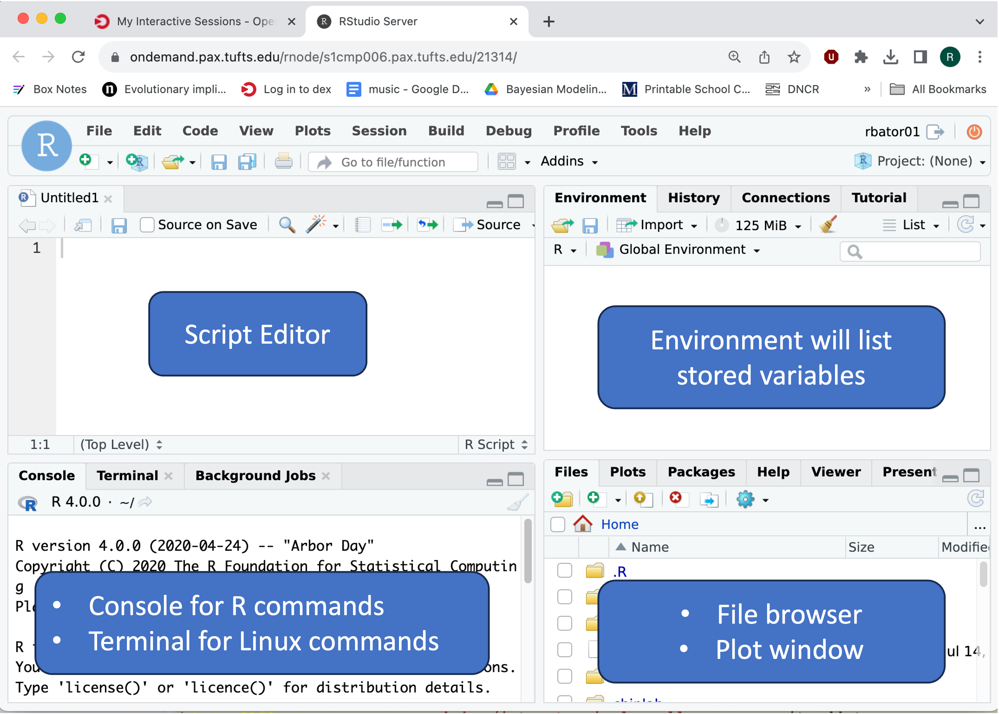

# Setting up your work on the Tufts High Performance Compute (HPC) Cluster

!!! example "Prerequisites"
    - [Request an account](http://research.uit.tufts.edu/) on the Tufts HPC Cluster. Note if you signed up for the Introduction to Single-Cell RNA-Seq workshop this will have been done for you.
    - Connect to the [VPN](https://access.tufts.edu/vpn) if off campus
    

## Navigate To The Cluster

Once you have an account and are connected to the VPN/Tufts Network, navigate to the [OnDemand Website](https://ondemand.pax.tufts.edu/){:target="_blank" rel="noopener"} and log in with your tufts credentials. Once you are logged in you'll notice a few navigation options:

!!! info "OnDemand Layout"

    

Click on `Interactive Apps > RStudio Pax` and you will see a form to fill out to request compute resources to use RStudio on the Tufts HPC cluster. We will fill out the form with the following entries:

- `Number of hours` : `5`
- `Number of cores` : `1`
- `Amount of memory` : `16GB`
- `R version` : `4.0.0`
- `Reservation for class, training, workshop` : `Bioinformatics Workshops`
    - **NOTE: This reservation will be available for registered participants only on Oct 26th and Nov 2nd 2023, use `Default` in all other cases.**

Click `Launch` and wait until your session is ready. Click `Connect To RStudio Server`, and a new tab will open with Rstudio. 

 


??? question "Are you connected to RStudio?"
    - Yes (put up a green check mark in zoom)
    - No (raise hand in zoom)


## Data & Scripts

To copy over the data and scripts we will need for the workshop into our home directory, enter the following command into the Console in the lower left and press enter. 

```R
file.copy(from="/cluster/tufts/bio/tools/training/intro_to_scrnaseq",to="~/", recursive = TRUE)
```

To see that our folder was copied over, we'll refresh our file list in the lower right hand Rstudio pane by clicking the `refresh` arrow {width=5%, height=5%}. 

To open our first workshop script:
- Click on the `Files` tab in the lower right hand Rstudio pane
- Click on the `intro_to_scrnaseq` directory
- Click on the `scripts` folder
- Click on the `02_formatting.Rmd` script
