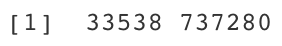

# Single Cell RNA Sequencing Data Structures in R

In this section we will describe the common data structures of singe cell RNA sequencing data (scRNAseq) data and how to read in and manipulate these data in R, specifically using the [`Seurat`](https://satijalab.org/seurat/) package. Furthermore, we will demonstrate how to read-in and merge multiple data sets. Portions of this section have been adapted from a previous Tufts HPC [workshop](https://hbctraining.github.io/scRNA-seq/lessons/03_SC_quality_control-setup.html).

## The Data

For this workshop we will be working with a scRNAseq dataset which is part of a larger study from [Kang et al, 2017](https://www.nature.com/articles/nbt.4042). The data is comprised of pooled Peripheral Blood Mononuclear Cells (PBMCs) taken from lupus patients, split into control and interferon beta-treated (stimulated) conditions. The counts for this dataset is freely available from 10X Genomics and is used as part of a [Seurat tutorial](https://satijalab.org/seurat/archive/v3.0/immune_alignment.html).

Since they comprise PBMCs, we expect these data to include mononuclear immune cells, such as

- B cells
- T cells
- Natural killer cells
- Monocytes
- Macrophages

and exclude polymorphonuclear immune cell types (neutrophils) and  nucleus lacking blood cells (erythrocytes and platelets).

## Setting up R environment

### R library source

This workshop requires a series of R libraries. In order to load these libraries we will first set their path in our R environment.

```R
LIB='/cluster/tufts/hpc/tools/R/4.0.0/'
.libPaths(c("",LIB))
```

### Read in R packages

For this section, requires three R packages:

1. `Seurat` : A package for working with and analysis of scRNAseq data. Comprehensive tutorials for available analyses with the `Seurat` R package are available on the project [website](https://satijalab.org/seurat/).
2. `Matrix`: A package for working with large data matrices.
3. `tidyverse` : Actually a compendia of packages, which include functionality for "tidy" data wrangling.

```R
library(Seurat)
library(Matrix)
library(tidyverse)
```

### Set base directory

We will be reading in and writing files relative to our `intro_to_scrnaseq`. For simplicity, we will create an R object that is simply a character string that gives this path, and use it as a prefix for reading and writing files.

```R
baseDir <- "~/intro_to_scrnaseq/"
```

## scRNAseq count files

Following pre-processing of raw files, scRNAseq count data is generally stored in directories containing three files. In this workshop will be working with two scRNAseq count data sets for each of our two condition, stored in two directories:

1. `ctrl_raw_feature_bc_matrix` : Control PBMCs
2. `stim_raw_feature_bc_matrix` : Interferon beta-treated (stimulated) PBMCs

Each directory contains our count data as three compressed files:

1. `barcodes.tsv.gz`
2. `features.tsv.gz`
3. `matrix.mtx.gz`

Next, we will read in describe each file in the `ctrl_raw_feature_bc_matrix` directory.

### `barcodes.tsv.gz`

This is a text file which contains all cellular barcodes present for that sample. Barcodes are listed in the order of data presented in the matrix file (i.e. these are the column names).

```R
barcodes <- read.delim(file.path(baseDir, "data/ctrl_raw_feature_bc_matrix/barcodes.tsv.gz"), header=F)
head(barcodes)
```


### `features.tsv.gz`

This is a text file which contains the identifiers of the quantified genes. The source of the identifier can vary depending on what reference (i.e. Ensembl, NCBI, UCSC) you use in the quantification methods, but most often these are official gene symbols. The order of these genes corresponds to the order of the rows in the matrix file (i.e. these are the row names).

```R
features <- read.delim(file.path(baseDir, "data/ctrl_raw_feature_bc_matrix/features.tsv.gz"), header=F)
head(barcodes)
```


### `matrix.mtx.gz`

This is a text file which contains a matrix of count values. The rows are associated with the gene IDs above and columns correspond to the cellular barcodes. Note that there are many zero values in this matrix.

Note, we will read this file in R, using the `readMM()` function from the `Matrix` package. This will create a "sparse matrix" which is formatted to save space due the redundancy of 0 values. When we view this object, 0 values are shown as "."s. Below, we print the first ten rows and columns.

```R
matrix <- readMM(file.path(baseDir, "data/ctrl_raw_feature_bc_matrix/matrix.mtx.gz"))
matrix[1:10, 1:10]
```


Based on the dimensions of this object, we see that there are 33,538 genes (rows), and 737,280 samples (columns) in these data.

```R
dim(matrix)
```



## Creating Seurat objects

As previously mentions, in this workshop, we are going to perform the bulk of scRNAseq data manipulation and analysis using the `Seurat` R package. To this end, we are going to start by reading in the data to a `Seurat` object. A `Seurat` object has a specific data structure, for which functionality of the `Seurat` R package is built around for performing various procedures with our scRNAseq data.

This can be performed in two steps.

First, we use the `Read10X()` function from the `Seurat` package to load our scRNAseq data into R. Rather than reading in each file individually, we only need to set the path to the directory, which contains each of the three data files described above.

```R
ctrl_counts <- Read10X(data.dir = file.path(baseDir, "data/ctrl_raw_feature_bc_matrix"))
```

Second, we use the `CreateSeuratObject()` function to convert the data as a `Seurat` object. Additionally, when we implement this function, we perform an initial data processing step by setting `min.features = 100`. This will remove cell profiles for which there are fewer than 100 genes with counts greater than 0.

```R
ctrl <- CreateSeuratObject(counts = ctrl_counts,
                           min.features = 100)
```

## Seurat object  structure

Basic features of a `Seurat` object can be viewed by simply calling the object itself.

For example, viewing the object output we can see that after filtering low coverage samples, we are left with 15,688 cell profiles. Which is only about 2% of the total in the raw count matrix file.

```R
ctrl
```


## Expression data "assays"

Note that as part of the output we see the term "Active assay: RNA". In `Seurat` objects, expression data is organized into these "assays", where each assay is a container of which different states of the expression data are stored separately. Every assay contains three "slots":

- `RNA` assay
    - `count`
    - `data`
    - `scale.data`

### The `count` slot

The `count` slot always contains the expression data as counts as a sparse matrix. Below are a couple of examples for accessing these data from the Seurat object.

```R
countSlot <- ctrl@assays$RNA@counts[1:5, 1:5]
countSlot <- GetAssayData(ctrl, slot = "counts")[1:5, 1:5]
countSlot[1:5, 1:5]
```


### The `data` slot

The purpose of the `data` slot is to store normalized data. We will perform normalization procedures later in this workshop, and this is commonly performed using the `NormalizeData()` `Seurat` function. However, since no normalization has been performed, the `data` slot is currently identical to the `count` slot.

```R
dataSlot <- ctrl@assays$RNA@data
dataSlot <- GetAssayData(ctrl, slot = "data")
dataSlot[1:5, 1:5]
```


### The `scale.data` slot

Numerous analytic procedures are best suited for data that has been scaled, such that the mean expression of every genes is equal to 0 with standard deviation equal to 1. This procedure is generally performed on normalized data, and the resulting "scaled" data is stored in the `scale.data` slot. Accordingly, right now this slot is an empty matrix.

```R
scalSlot <- ctrl@assays$RNA@scale.data
scalSlot <- GetAssayData(ctrl, slot = "scale.data")
scalSlot
```


### `Seurat` objects with multiple assays

To prevent overwriting data or necessitating the creation of multiple `Seurat` objects, various procedures will create new assays for storing data. For example, later in this workshop we will perform a procedure, using the `SCTransform()` function (detailed later), which creates a new assay and the resulting assay structure of the `Seurat` object will have an assay structure:

- RNA assay
    - count
    - data
    - scale.data
- SCT assay
    - count
    - data
    - scale.data

We can list the available assays that have been created using the `Assays()` `Seurat` function. More importantly we can set the default assay using the `DefaultAssay()` function. This is good practice when working with `Seurat` objects containing multiple assays, to ensure that specific procedures are performed on the data for which they are intended.

```R
Assays(ctrl)
DefaultAssay(ctrl) <- "RNA"
```

## Cell profile metadata

In `Seurat` objects, the "metadata" refers to a data frame, in which we store additional information for each cell profile.

We can access this data from the `Seurat` object in a number of ways. For example, below we show two ways of accessing the entire metadata data frame.

```R
metaData <- ctrl[[]]
metaData <- ctrl@meta.data
head(metaData)
```


Here, the rows are in the same order as the expression matrix, which allows use to index the expression data based on this information. 

By default, the `CreateSeuratObject()` function creates three columns in the meta.data

- `orig.ident`: An identifier for the data set
- `nCount_RNA`: The total number of counts each cell profile
- `nFeature_RNA`: The total number of genes with counts > 0. 

In addition to all columns there are a number of ways to extract specific columns in the metadata directly from the `Seurat` object. For example, here are two ways we can extract the `nCount_RNA` column from the metadata.

```R
nCount <- ctrl$nCount_RNA
nCount <- ctrl@meta.data$nCount_RNA
head(nCount)
```


Alternatively, there are many ways to extract multiple metadata columns from the `Seurat` object.

```R
multCols <- ctrl@meta.data[, c("nCount_RNA", "nFeature_RNA")]
multCols <- ctrl[[c("nCount_RNA", "nFeature_RNA")]]
head(multCols)
```


## Combining data sets

It is common for scRNAseq projects to include multiple samples profiled separately. In our case we have two separate data sets, comprising profiles from "control" and "stimulated" PBMC samples. Accordingly, we're going to combine these data into a single `Seurat` object, while assigning information as to their source in the metadata.

Here, we use a `for` loop to read in each of the two data sets. Within each we assign an identity to each data set using the `project` argument.

```R
for (file in c("ctrl_raw_feature_bc_matrix", "stim_raw_feature_bc_matrix")){
  seurat_data <- Read10X(data.dir = file.path(baseDir, "data", file))
  seurat_obj <- CreateSeuratObject(counts = seurat_data, 
                                   min.features = 100, 
                                   project = file)
  assign(file, seurat_obj)
}
```

We have just created two `Seurat` objects, `ctrl_raw_feature_bc_matrix` and `stim_raw_feature_bc_matrix`. And if we check the metadata of `ctrl_raw_feature_bc_matrix` to see that its source has been saved in the `orig.identity` column.

```R
head(ctrl_raw_feature_bc_matrix@meta.data)
```


Finally, we merge the two `Seurat` objects with the `merge()` function below. Since each data set will contain likely some of the same cell profile identifiers, e.g. "AAACATACAATGCC-1", we add a prefix to these identifiers using the `add.cell.id` argument.

```R
merged_seurat <- merge(x = ctrl_raw_feature_bc_matrix, 
                       y = stim_raw_feature_bc_matrix, 
                       add.cell.id = c("ctrl", "stim"))
```

Using the `orig.identity` column we can check how many cell profiles from each data set are contained in the merged data set.


```R
table(merged_seurat@meta.data$orig.ident)
```


## Adding metadata for downstream analyses

Now that we have the fully merged scRNAseq data, we will add a couple additional columns to our metadata, which we will later use for quality control. These columns comprise calculations of two metrics, which are indicative the quality of individual cell profiles.

- **Novelty score**: this metric with give us an idea of the complexity of our dataset (more genes detected per UMI, more complex our data).
- **Percent mitochondrial UMI**: this metric will give us a percentage of cell reads originating from the mitochondrial genes

### Novelty score

This value is quite easy to calculate, as we take the **log10** of the number of genes detected per cell and the **log10** of the number of UMIs per cell, then divide the **log10** number of genes by the log10 number of UMIs. The novelty score and how it relates to complexity of the RNA species, is described in more detail later in this lesson.

```R
merged_seurat$log10GenesPerUMI <- log10(merged_seurat$nFeature_RNA) / log10(merged_seurat$nCount_RNA)
```

### Percent mitochondrial UMI

Seurat has a convenient function that allows us to calculate the **proportion of transcripts mapping to mitochondrial genes(. The `PercentageFeatureSet()` function takes in a pattern argument and searches through all gene identifiers in the dataset for that pattern. Since we are looking for mitochondrial genes, we are searching any gene identifiers that begin with the pattern "MT-". For each cell, the function takes the sum of counts across all genes (features) belonging to the "Mt-" set, and then divides by the count sum for all genes (features). This value is multiplied by 100 to obtain a percentage value.

```R
merged_seurat$percMitoUMI <- PercentageFeatureSet(object = merged_seurat, pattern = "^MT-")
```

## Finishing touches

Finally, we will make a few additional changes to our metadata to facilitate downstream analyses.

First, we will create a new metadata column with simplified identifers for each of the merged data sets. We can do this easily, by taking the first 4 characters of the values from the `orig.identity` column, and assigning them to a new column.

```R
merged_seurat$sample <- substr(merged_seurat@meta.data$orig.ident, 1, 4)

table(merged_seurat$sample)
```


Next, we will rename several of metadata column names short, so they are shorter and more intuitive (to us at least).

```R
merged_seurat@meta.data <- merged_seurat@meta.data %>%
  dplyr::rename(seq_folder = orig.ident,
                nUMI = nCount_RNA,
                nGene = nFeature_RNA)
```

Lastly we can check the final formatted metadata dataframe with all of our newly added and formatted metadata columns. These are a lot of columns to view in our console and html output, so we'll just use the `View()` R function.

```
View(merged_seurat@meta.data)
```


## Save seurat object

That's it! At this point, we can save our merged data set and move on to quality control.

```R
saveRDS(merged_seurat, file.path(baseDir, "data/merged_seurat.rds"))
```
```


