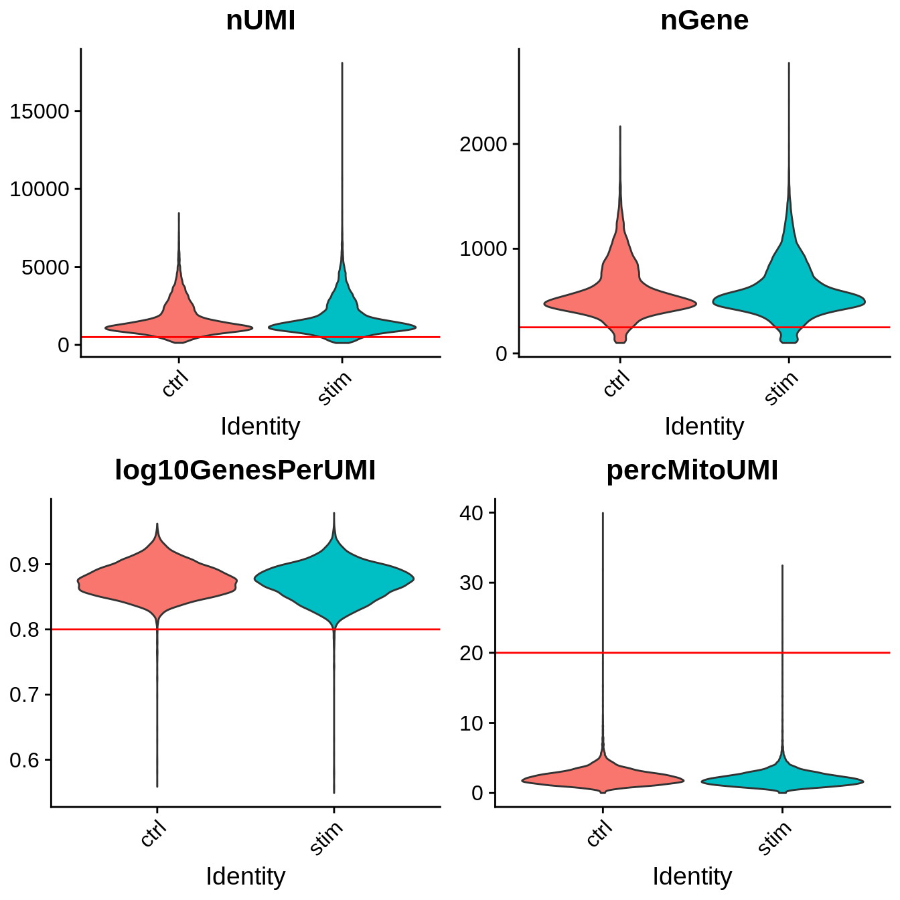
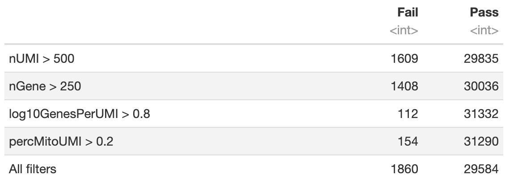

# Single Cell RNA Sequencing Quality Control

In this section we will describe strategies for filtering out "low-quality" cell profiles from scRNAseq data. We will perform quality control our two-sample combined and formatted PBMC scRNAseq data set [`Seurat`] object generated in the previous section.nPortions of this section have been adapted from a previous Tufts HPC [workshop](https://hbctraining.github.io/scRNA-seq/lessons/03_SC_quality_control-setup.html).

## Setting up R environment

We begin by setting up our R environment similar to the previous section.

### R library source

We will be reading in and writing files relative to our `intro_to_scrnaseq`. For simplicity, we will create an R object that is simply a character string that gives this path, and use it as a prefix for reading and writing files.

```R
LIB='/cluster/tufts/hpc/tools/R/4.0.0/'
.libPaths(c("",LIB))
```

### Read in R packages

For this section, requires three R packages:

1. `Seurat` : A package for working with and analysis of scRNAseq data. Comprehensive tutorials for available analyses with the `Seurat` R package are available on the project [website](https://satijalab.org/seurat/).
2. `ggplot2`: The standard package for creating plots in R. Much of the plotting functions are wrappers for `ggplot2` functionality.
3. `cowplot` : A nice package for combining plots into a single figure. Specifically we will make use of of the `plot_grid()` function.

```R
library(Seurat)
library(ggplot2)
library(cowplot)
```

### Set base directoryZ

```R
baseDir <- "~/intro_to_scrnaseq/"
```

## Read in combined and formatted PBMC `Seurat` object

```R
merged_seurat <- readRDS(file.path(baseDir, "data/merged_seurat.rds"))
```

## Quality Control Filtering

Now that we have generated the various metrics to assess, we can explore them with visualizations. We will assess various metrics and then decide on which cells are low quality and should be removed from the analysis:

- **Metric** : **Metadata Column**
- UMI counts per cell : nUMI
- Genes detected per cell : nGene
- Complexity (novelty score) : log10GenesPerUMI
- Percent mitochondrial UMI : percentMitoUMI

### UMI counts (transcripts) per cell

The UMI counts per cell should generally be above 500, that is the low end of what we expect. If UMI counts are between 500-1000 counts, it is usable but the cells probably should have been sequenced more deeply.

### Genes detected per cell

We have similar expectations for gene detection as for UMI detection, although it may be a bit lower than UMIs. For high quality data, the proportional histogram should contain a single large peak that represents cells that were encapsulated. If we see a small shoulder to the left of the major peak (not present in our data), or a bimodal distribution of the cells, that can indicate a couple of things. It might be that there are a set of cells that failed for some reason. It could also be that there are biologically different types of cells (i.e. quiescent cell populations, less complex cells of interest), and/or one type is much smaller than the other (i.e. cells with high counts may be cells that are larger in size). Therefore, this threshold should be assessed with other metrics that we describe in this lesson.

### Complexity

We can evaluate each cell in terms of how complex the RNA species are by using a measure called the novelty score. The novelty score is computed by taking the ratio of nGenes over nUMI. If there are many captured transcripts (high nUMI) and a low number of genes detected in a cell, this likely means that you only captured a low number of genes and simply sequenced transcripts from those lower number of genes over and over again. These low complexity (low novelty) cells could represent a specific cell type (i.e. red blood cells which lack a typical transcriptome), or could be due to an artifact or contamination. Generally, we expect the novelty score to be above 0.80 for good quality cells.

### Percent mitochondrial UMIs

This metric can identify whether there is a large amount of mitochondrial contamination from dead or dying cells. We define poor quality samples for mitochondrial counts as cells which surpass the 20% percent mitochondrial unless of course you are expecting this in your sample.

## Visualize quality control metrics

We begin by visualizing our four quality control metrics using the `VlnPlot()` function from the `Seurat` package. This will show us the general distribution of values for each variable and offer a visual comparison of these distributions between our two samples. Moreover, we will visualize our thresholds for filtering. To recap, we will keep cell profiles that pass the following criteria.

- nUMI > 500
- nGene > 250
- log10GenesPerUMI > 0.8
- percMitoUMI < 20

```R
# Plot UMI counts per cell
PnUMI <- VlnPlot(object = merged_seurat, 
        features = "nUMI",
        group.by = "sample",
        pt.size = 0) +
  geom_hline(yintercept = 500, color = "red") +
  theme(legend.position = "none",
        plot.margin = unit(c(0, 0, 0, 0), "cm"))

# Plot genes detected per cell
PnGene <- VlnPlot(object = merged_seurat, 
        features = "nGene",
        group.by = "sample",
        pt.size = 0) +
  geom_hline(yintercept = 250, color = "red") +
  theme(legend.position = "none",
        plot.margin = unit(c(0, 0, 0, 0), "cm"))

# Plot complexity (novelty score)
Plog10GpUMI <- VlnPlot(object = merged_seurat, 
        features = "log10GenesPerUMI",
        group.by = "sample",
        pt.size = 0) +
  geom_hline(yintercept = 0.8, color = "red") +
  theme(legend.position = "none",
        plot.margin = unit(c(0, 0, 0, 0), "cm"))

# Plot percent mitochondrial UMI
PpMito <- VlnPlot(object = merged_seurat, 
        features = "percMitoUMI",
        group.by = "sample",
        pt.size = 0) +
  geom_hline(yintercept = 20, color = "red") +
  theme(legend.position = "none",
        plot.margin = unit(c(0, 0, 0, 0), "cm"))

# Combine plots
plot_grid(PnUMI, PnGene, Plog10GpUMI, PpMito, ncol = 2)
```



### Joint filtering effects

Two metrics that are often evaluated together are the number of UMIs and the number of genes detected per cell. Here, we have plotted the number of genes versus the number of UMIs coloured by the fraction of mitochondrial reads. Jointly visualizing the count and gene thresholds and additionally overlaying the mitochondrial fraction, gives a summarized perspective of the quality per cell.

```R
merged_seurat@meta.data %>% 
  	ggplot(aes(x=nUMI, y=nGene, color=percMitoUMI)) + 
  	geom_point() + 
    scale_colour_gradient(low = "gray90", high = "black") +
  	scale_x_log10() + 
  	scale_y_log10() + 
  	theme_classic() +
  	geom_vline(xintercept = 500, color = "red") +
  	geom_hline(yintercept = 250, color = "red") +
  	facet_wrap(~sample)
```

Next, we can check the number of cells that pass each threshold.

```R
# nUMI
TABnUMI <- table(merged_seurat$nUMI > 500)

# nGene
TABnGene <- table(merged_seurat$nGene > 250)

# log10GenesPerUMI
TABlog10GpUMI <- table(merged_seurat$log10GenesPerUMI > 0.8)

# percMitoUMI
TABpercMitoUMI <- table(merged_seurat$percMitoUMI > 0.2)

# All filters
TABall <- table(merged_seurat$nUMI > 500 &
                  merged_seurat$nGene > 250 &
                  merged_seurat$log10GenesPerUMI > 0.8 &
                  merged_seurat$percMitoUMI > 0.2)

# Compile results to a single data frame
filterDF <- as.data.frame(rbind(TABnUMI, TABnGene, TABlog10GpUMI, TABpercMitoUMI, TABall))
rownames(filterDF) <- c("nUMI > 500", 
                        "nGene > 250", 
                        "log10GenesPerUMI > 0.8", 
                        "percMitoUMI > 0.2", 
                        "All filters")
colnames(filterDF) <- c("Fail", "Pass")

filterDF
```



### Filter cell profiles in `Seurat` object

Finally, we can filter the cell profiles using the `subset()` `Seurat` function.

```R
filtered_seurat <- subset(merged_seurat, 
                          subset = nUMI >= 500 & 
                                   nGene >= 250 & 
                                   log10GenesPerUMI > 0.80 & 
                                   percMitoUMI < 20)
```

### Choosing cell profile quality control thresholds

Considering any of these QC metrics in isolation can lead to misinterpretation of cellular signals. For example, cells with a comparatively high fraction of mitochondrial counts may be involved in respiratory processes and may be cells that you would like to keep. Moreover, specific cell populations may be more affected by data collection and library preparation procedures, leading to inflated mitochondrial UMI content of these populations. A general rule of thumb when performing QC is to set thresholds for individual metrics to be as permissive as possible, and always consider the joint effects of these metrics. In this way, you reduce the risk of filtering out any viable cell populations. 

Accordingly, a common strategy is to go start with permissive filtering, and assess whether cell clusters are characterized by aberrant high or low values of quality control metrics in downstream analyses. Moreover, evaluate how whether these abberations track with a lack of clear marker genes or if they can be characterized solely based on the presence of mitochondrial markers.

## Gene-level filtering

Within our data we will have many genes with zero counts. These genes can dramatically reduce the average expression for a cell and so we will remove them from our data. If a gene is only expressed in a handful of cells, it is likely not meaningful to our downstream analysis. Moreover, it's important to keep in mind that as we move forward in our analyses, size of `Seurat` objects may become quite large, generally on the order of gigabytes, which present headaches in terms of available memory and run time. Thus removing inconsequential features from our data can make our lives easier.

For our data we choose to keep only genes which are expressed in 10 or more cells.

```R
## Extract count matrix from Seurat object
counts <- GetAssayData(object = filtered_seurat, slot = "counts")

## Convert the counts to a matrix of logicals
## in which TRUE indicates counts > 0
nonzero <- counts > 0

# Sums all TRUE values and returns TRUE if more than 10 TRUE values per gene
keep_genes <- rowSums(nonzero) >= 10

table(keep_genes)
```


### Subset filtered seurat object

```{r}
filtered_seurat <- filtered_seurat[keep_genes,]
```

## Save seurat object

That's it! We not have a cell profile- and gene-wise QC'd `Seurat` object. In the following workshops we will move on to the procedures for yielding cluster estimates of our cell populations.

```R
saveRDS(filtered_seurat, file.path(baseDir, "data/filtered_seurat"))
```


