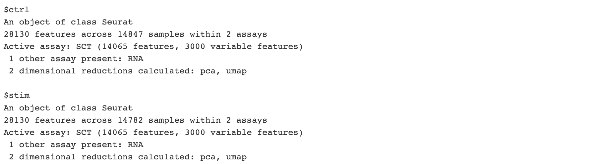

# Single Cell RNA Sequencing Normalization, Dimensionality Reduction, and Integration

In this section we will describe procedures for processing scRNAseq data to facilitate downstream analysis, particularly clustering of scRNAseq profiles to identify cell populations. These procedures include

- Normalization
- Dimensionality Reduction
- Integration

We will perform these procedures on our two-sample combined, formatted, and QC'd PBMC scRNAseq data set [`Seurat`] object generated in the previous sections. Portions of this section have been adapted from  previous Tufts HPC describing [normalization](https://hbctraining.github.io/scRNA-seq_online/lessons/06_SC_SCT_normalization.html) and [integration](https://hbctraining.github.io/scRNA-seq_online/lessons/06_integration.html).

## Setting up R environment

We begin by setting up our R environment similar to the previous sections.

### R library source

We will be reading in and writing files relative to our `intro_to_scrnaseq`. For simplicity, we will create an R object that is simply a character string that gives this path, and use it as a prefix for reading and writing files.

```R
LIB='/cluster/tufts/hpc/tools/R/4.0.0/'
.libPaths(c("",LIB))
```

### Read in R packages

For this section, requires three R packages:

1. `Seurat` : A package for working with and analysis of scRNAseq data. Comprehensive tutorials for available analyses with the `Seurat` R package are available on the project [website](https://satijalab.org/seurat/).
2. `ggplot2`: The standard package for creating plots in R. Much of the plotting functions are wrappers for `ggplot2` functionality.
3. `cowplot` : A nice package for combining plots into a single figure. Specifically we will make use of of the `plot_grid()` function.

```R
library(Seurat)
library(ggplot2)
library(cowplot)
```

### Set base directory

```R
baseDir <- "~/intro_to_scrnaseq/"
```

## Read in `Seurat` object

```R
filtered_seurat <- readRDS(file.path(baseDir, "data/merged_filtered_seurat.rds"))
```

## Expression normalization

Even for the same types of cells, the total number of UMIs that are counted is highly variable cell profile to cell profile. Accordingly, the UMI counts for each gene are not immediately comparable as they are proportional to the total number of reads. When performing data normalization we account for this variation by a dividing the reads from each cell by a scaling factor that is a function of the total number of reads of that cell.

### Log-transformation

The variance of normalized counts are affected by their magnitude. By performing log-transformation, we partially account for this source of variance, making gene profiles more immediately comparable. 

Data normalization and log-transformation can be performed in a single step with the `Seurat` package with the `NormalizeData()` function. Below we will run this function and create a new `Seurat` object, `norm_seurat`.

```R
norm_seurat <- NormalizeData(filtered_seurat)
```

Following `NormalizeData()`, the `data` "slot" of our `RNA` assay is not populated by our normalized and log-transformed count data. We can visualize this using the `VlnPlot()` `Seurat` function, where we specify the source of gene expression data using the `slot` argument. Below we visualize CD63 expression.

```R
## Plot CD63 counts
gPlotCount <- VlnPlot(object = norm_seurat, 
                      features = "CD63",
                      group.by = "sample",
                      assay = "RNA",
                      slot = "count") +
  ggtitle("CD63 Counts",
          subtitle = "RNA Assay")
          
## Plot CD63 normalized Expression
gPlotNorm <- VlnPlot(object = norm_seurat, 
                      features = "CD63",
                      group.by = "sample",
                      assay = "RNA",
                      slot = "data") +
  ggtitle("CD63 Norm. Expression",
          subtitle = "RNA Assay")
          
## Combine plots
plot_grid(gPlotCount, gPlotNorm, nrow = 1)
```


### Cleaning up R environment

`Seurat` objects contain a lot of data and become quite memory expensive. Especially when working on machines with limited available memory, removing objects we are done with can save headaches down the line. We are done with `filtered_seurat` so we can now go ahead and remove it.

```R
rm(filtered_seurat)
gc()
```

## Dimensionality reduction

The purpose of dimensionality reduction to capture the majority of variability in our data with fewer features than the 1,000s of genes in our data. By doing so we emphasize sources of variability that are indicative of similar and diverging cell types in our data. We can then use these new variables as input in numerous machine learning algorithms, such many of those employed for cluster analysis. Specifically, through Principal Component Analysis (PCA), we can reduce our matrix of 1,000's to 10's of features (i.e. principal components) that capture the majority of variabilty in our data.

### Feature selection

Our `Seurat` ojects is currently comprised of 14,065 features. Prior to running PCA, we will first identify 2,000 genes with high variance in our data. The justification of this is that highly variable genes should capture differences in expression across cell populations. Moreover, is makes calculation of our principal components less computationally expensive. We can perform feature selection using the `FindVariableFeatures()` `Seurat` function.

```R
norm_seurat <- FindVariableFeatures(norm_seurat, 
                                     selection.method = "vst",
                                     nfeatures = 3000, 
                                     verbose = FALSE)
```

### Expression scaling

PCA is highly affected by the scale of values in our data. Accordingly, appropriate application of PCA requires that expression values are scaled to mean = 0, and standard deviation = 1. We can perform this scaling using the `ScaleData()` `Seurat` function.

```R
norm_seurat <- ScaleData(norm_seurat)
```
Following `ScaleData()`, the `scale.data` "slot" of our `RNA` assay is not populated. Below we visualize CD63 expression of all three of out expression data slots.


Now that we have our scaled data comprising 2,000 genes, we can perform PCA, using the `RunPCA()` `Seurat` function.

```R
norm_seurat <- RunPCA(norm_seurat)
```

Next, we can visualize our first two principal components using the `PCAPlot()` `Seurat` function. Additionally, we will color our points by samples, "ctrl" and "stim", to evaluate whether variability in our data reflects these differences.

```R
pPlot <- PCAPlot(norm_seurat, group.by = "sample") +
  ggtitle("PCA",
          subtitle = "RNA Assay") +
  theme(
    legend.position = "bottom"
  )

pPlot
```


### Uniform manifold approximation

We just visualized the first two principal components in our data. However, it is more than likely that important variability in our data is captured by additional principal components. Uniform manifold approximation (UMAP) is a procedure for visualizing many variables in two dimensions. Importantly, UMAP should only be considered as a visualization tool, and our PCA matrix is what is leveraged in downstream clustering analyses. Next, we'll run UMAP with the `RunUMAP()` `Seurat` function, on the first 10 principal components using the `dims` argument.

```R
norm_seurat <- RunUMAP(norm_seurat, dims = seq(10))
```

Now we can visualize our UMAP output side-by-side with our first two principal components.

```R
uPlot <- UMAPPlot(norm_seurat, group.by = "sample") +
  ggtitle("UMAP",
          subtitle = "RNA Assay")

plot_grid(pPlot, uPlot, nrow = 1)
```


## Alternative expression normalization and scaling with `SCTransform()`

In the [Hafemeister and Satija, 2019](https://genomebiology.biomedcentral.com/articles/10.1186/s13059-019-1874-1) paper the authors explored the issues with simple transformations. Specifically they evaluated the standard log normalization approach and found that genes with different abundances are affected differently and that effective normalization (using the log transform) is only observed with low/medium abundance genes (Figure 1D, below). Additionally, substantial imbalances in variance were observed with the log-normalized data (Figure 1E, below). In particular, cells with low total UMI counts exhibited disproportionately higher variance for high-abundance genes, dampening the variance contribution from other gene abundances.


The proposed solution was the use of **Pearson residuals for transformation**, as implemented in the `Seurat` `SCTransform()` function. With this approach:

- Measurements are multiplied by a gene-specific weight
- Each gene is weighted based on how much evidence there is that it is non-uniformly expressed across cells
- More evidence == more of a weight; Genes that are expressed in only a small fraction of cells will be favored (useful for finding rare cell populations)
- Not just a consideration of the expression level is, but also the distribution of expression

In the next code chunk, we demonstrate usage of the `SCTransform()` function. **DO NOT RUN THIS.** `SCTransform()` is more computationally expensive and takes several minutes to run. Instead we will read in a a saved `norm_seurat` object, for which `SCTransform()` has been performed.

```{R}
### DON'T RUN!!
norm_seurat <- SCTransform(norm_seurat)
```

#### Read in `SCTransorm()` `Seurat` object

```{R}
norm_seurat <- readRDS(file.path(baseDir, "data/normalized_seurat.rds"))
```

Rather than replacing the data in our `RNA` assay, `SCTransform()` creates a new assay `SCT`, and sets it as the default assay. This new assay contains fully populated count, normalized, and scaled data, in the `count`, `data`, and `scale.data` slots, respectively. 

```R
norm_seurat
```


```R
DefaultAssay(norm_seurat)
```


Importantly, `Seurat` functions will generally use the active (i.e. default) assay unless otherwise specified. Since `SCT` is now our e can re-run our PCA and UMAP on the `SCTransform()` scaled data using the same commands. Importantly, this **will** overwrite these matrices in our `Seurat` object because these are stored separately from assays. 

```{r}
## Run PCA on SCT assay
norm_seurat <- RunPCA(norm_seurat)

## Run UMAP on first 10 PCs from updated PCA matrix
norm_seurat <- RunUMAP(norm_seurat, dims = seq(10))
```

Next, we will visualize our PCA and UMAP results calculated from our `SCT` assay side-by-side with those calculated from our `RNA` assay.

```R
## Plot SCT PCA results
pPlotSCT <- PCAPlot(norm_seurat, group.by = "sample") +
  ggtitle("PCA",
          subtitle = "SCT Assay") +
  theme(
    legend.position = "bottom"
  )

## Plot SCT UMAP results
uPlotSCT <- UMAPPlot(norm_seurat, group.by = "sample") +
  ggtitle("UMAP",
          subtitle = "SCT Assay") +
  theme(
    legend.position = "bottom"
  )

# Combine Plots
plot_grid(pPlot, pPlotSCT, 
          uPlot, uPlotSCT, nrow = 2)
```


Regardless of our normalization approach, it is clear that much of the variability in our data arise from differences between the data sets. This may arise from various sources. For one, our two samples represent two different conditions, i.e. control and interferon beta-treatment. Alternatively, these difference can arise from numerous technical factors during sample collection and library preparation, akin to "batch" effects, which are common in RNAseq experiments. 

Importantly, we expect to find most if not all of the same cell types represented these samples/conditions, and we will seek to characterize these cell types via clustering analysis. Thus, we'd like cells of the same type to cluster together in order to make these results more interpretable and cell types easier to characterize. 

Next, we will perform data integration to "harmonize" the expression profiles across these samples with the goal of overlaying transcriptomic profiles of shared cell types.

## Data Integration

The data integration procedure from the `Seurat` package is carried out in four main steps

1. Identification of shared highly variable genes across data sets, performed by the `SelectIntegrationFeatures()`.
2. Ensure that each data set has been normalized and scaled based on these features, performed by `PrepSCTIntegration()`.
3. Scores the relative similarity of individual cells across data sets, performed by `FindIntegrationAnchors()`. This is actually performed in two substantial sub-steps:
  - Canonical Correlation Analysis (CCA)
  - Mutual Nearest Neighbors (MMN)
4. Projects the expression profiles of individual cells to be more similar to their counterparts across data sets, performed by `IntegrateData()`.

### Canonical Correlation Analysis

### Mutual Nearest Neighbors


We begin by splitting our `Seurat` object into a `list` object of two `Seurat` objects for each sample, "ctrl" and "stim", with the `SplitObject()` `Seurat` function.

```R
split_seurat <- SplitObject(norm_seurat, split.by = "sample")

split_seurat
```



At this point we will not be doing anything with our `norm_seurat` object. So let's remove it to save space.

```R
rm(norm_seurat)
gc()
```

**Sadly, at this point the following integration steps are quite memory expensive and slow. For this reason we give an example of how to run the integration workflow, but we will skip running the code. Instead will read in a previously integrated `Seurat` object generated by these steps.

### Select integration features

```R
## DON'T RUN!
integ_features <- SelectIntegrationFeatures(object.list = split_seurat, 
                                            nfeatures = 3000) 
```

### Prepare the SCT list object for integration

```R
## DON'T RUN!
split_seurat <- PrepSCTIntegration(object.list = split_seurat, 
                                   anchor.features = integ_features)
```

### Perform CCA and identify mutual nearest neighbots

```R
## DON'T RUN!
integ_anchors <- FindIntegrationAnchors(object.list = split_seurat, 
                                        normalization.method = "SCT", 
                                        anchor.features = integ_features)
```

### Integrate data

```R
## DON'T RUN!
integ_seurat <- IntegrateData(anchorset = integ_anchors, 
                                   normalization.method = "SCT")
```

#### Read in integrated `Seurat` object

```R
integ_seurat <- readRDS(file.path(baseDir, "data/integrated_seurat.rds"))
```

Similarly to when we ran `SCTransform()`, the integration workflow results in new assay in our `Seurat` object, `integrated` and set it as the active (default) assay.

```R
integ_seurat
```


```R
DefaultAssay(integ_seurat)
```


### Check integrated data set

Now that we have performed the integration procedure, we can interrogate our `integrated` assay for differences between samples using dimensionality reduction.

As before we'll re-run PCA, followed by re-running UMAP on the first 10 principal components.

```{r}
## Run PCA on integrated assay
integ_seurat <- RunPCA(integ_seurat)

## Run UMAP on first 10 PCs from updated PCA matrix
integ_seurat <- RunUMAP(integ_seurat, dims = seq(10))
```

Finally, we will visualize our PCA and UMAP results calculated from our `integrated` assay side-by-side with those calculated from the `SCT` assay of the un-integrated data.


That's it! Now, we have a fully processed and integrated data set. In the next section we will go over procedures for clustering scRNAseq to facilitate cell population identification.

