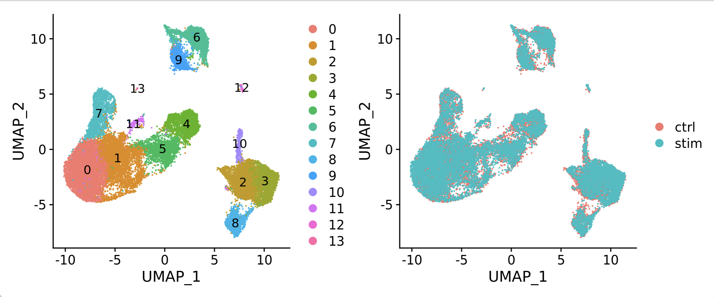
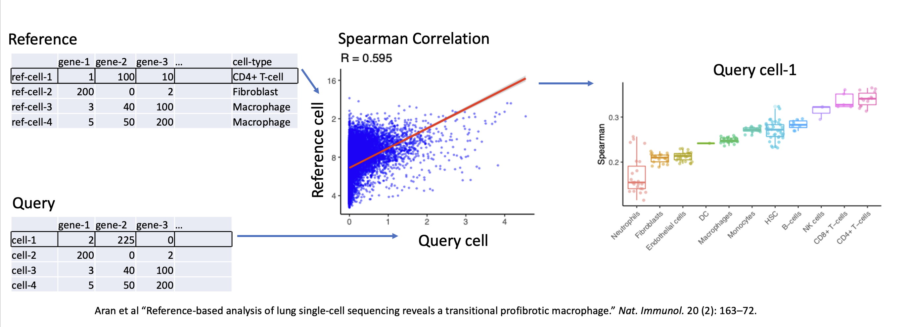
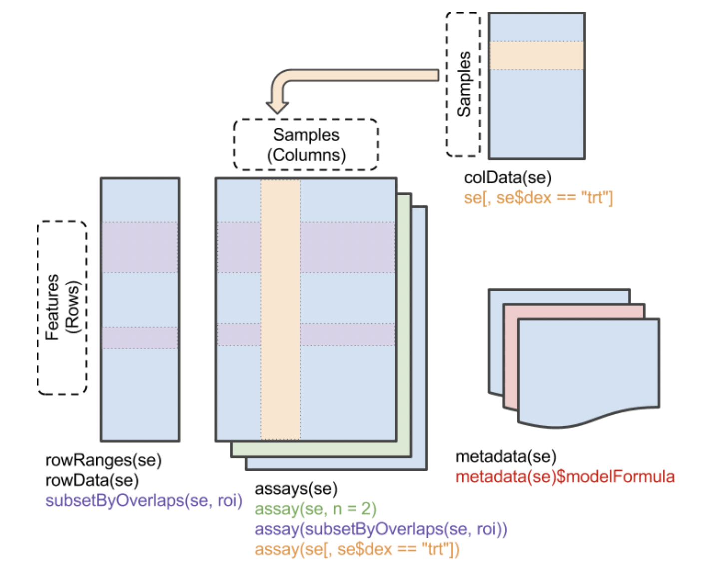
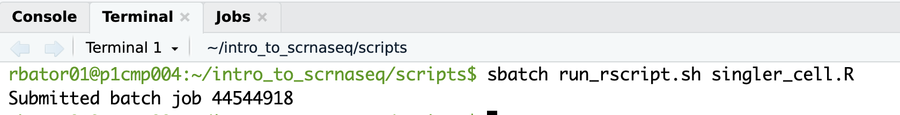
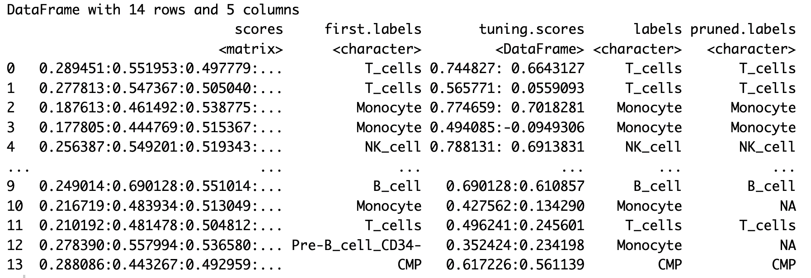
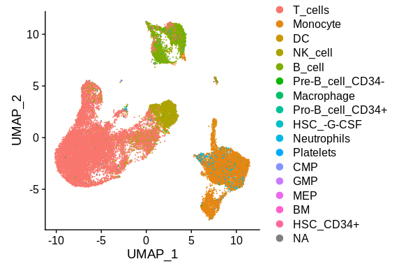
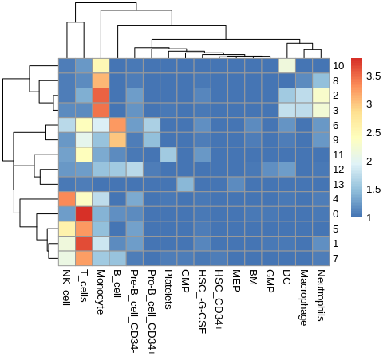

## Cell type identification

To start, we load our library path, libraries and set our working directory:
```R
LIB='/cluster/tufts/hpc/tools/R/4.0.0/'
.libPaths(c("",LIB))
library(tidyverse)
library(Seurat)
library(SingleR)
library(celldex)
library(pheatmap)
setwd("~/intro_to_scrnaseq/")
```

We begin by loading our integrated samples.
```R
seurat_integrated = readRDS("results/integrated_seurat.rds")
```

Set our identities to be the clusters found at the resolution 0.4
```R
Idents(object = seurat_integrated) <- "integrated_snn_res.0.4"
```

View a UMAP plot of the clusters.
```R
DimPlot(seurat_integrated, label=T)
```


We'll use the [SingleR](https://github.com/LTLA/SingleR) tool with a reference database of expression profiles of known cell types in order to identify our cells and clusters. As mentioned in the lecture, this method measures the correlation of overall gene expression between cells in a reference database with cells in the query dataset in order to label cells  



To start, we'll use a general database of Human pure cell-types called the Human Primary Cell Type Atlas.  This dataset along with several others is available through the [celldex](https://rdrr.io/github/LTLA/celldex/man/HumanPrimaryCellAtlasData.html) R library. To load:
```R
hpca = HumanPrimaryCellAtlasData()
```

The HPCA object is of the data type called a `Summarized Experiment` which allows one to store count data matrices in assays along with metadata which annotate each cell/sample in the count data.

```R
head(hpca)
```

!!! info "output"
```R
class: SummarizedExperiment 
dim: 6 713 
metadata(0):
assays(1): logcounts
rownames(6): A1BG A1BG-AS1 ... A2M-AS1 A2ML1
rowData names(0):
colnames(713): GSM112490 GSM112491 ... GSM92233 GSM92234
colData names(3): label.main label.fine label.ont
```

Summarized Experiments have the following form:



Well use in particular the label.main column of the metadata, which has the following cell-types:

```R
unique(hpca$label.main)
```

!!! info "output"
```R
 [1] "DC"                   "Smooth_muscle_cells"  "Epithelial_cells"     "B_cell"              
 [5] "Neutrophils"          "T_cells"              "Monocyte"             "Erythroblast"        
 [9] "BM & Prog."           "Endothelial_cells"    "Gametocytes"          "Neurons"             
[13] "Keratinocytes"        "HSC_-G-CSF"           "Macrophage"           "NK_cell"             
[17] "Embryonic_stem_cells" "Tissue_stem_cells"    "Chondrocytes"         "Osteoblasts"         
[21] "BM"                   "Platelets"            "Fibroblasts"          "iPS_cells"           
[25] "Hepatocytes"          "MSC"                  "Neuroepithelial_cell" "Astrocyte"           
[29] "HSC_CD34+"            "CMP"                  "GMP"                  "MEP"                 
[33] "Myelocyte"            "Pre-B_cell_CD34-"     "Pro-B_cell_CD34+"     "Pro-Myelocyte" 
```

Our data to be labeled is input into SingleR as a normalized count matrix, which we can extract from the `RNA` assay our `seurat_integrated` object:
```R
query_counts = seurat_integrated@assays$RNA@data
```

SingleR can be run both on the cluster level and the individual cell level. For cluster-level annotation, the average expression profile of each cluster is used and a single label is generated. This is much faster to run, so we'll start here.

```R
query_clusters = seurat_integrated@meta.data$integrated_snn_res.0.4
```

The following command runs SingleR on the cluster level, which should take only a few seconds. We'll save the result to a file.
```R
pred_cluster <- SingleR(test = query_counts,
                        ref = hpca,
                        assay.type.test="logcounts",
                        clusters = query_clusters,
                        labels = hpca$label.main, 
                        prune=F)

saveRDS(pred_cluster, "results/singler_hpca_cluster_res0.4.rds")
```

Running on the individual cell level will take longer, so we'll run it as a batch job. To do this, navigate to our scripts directory and open `singler_cell.R`. This file contains the key steps above, but eliminates the `labels` argument from the SingleR command.

```R
pred_cluster <- SingleR(test = query_counts,
                        ref = hpca,
                        assay.type.test="logcounts",
                        clusters = query_clusters)

saveRDS(pred_cluster, "results/singler_hpca_cell.rds")
```

To run it, we use the `run_r_script.sh` script in the `scripts` directory. Click to open the file:

```bash
#!/bin/bash
#SBATCH -J run_r_script
#SBATCH --partition=patralab
#SBATCH --time=2:00:00 
#SBATCH -n 1
#SBATCH -N 1
#SBATCH --mem=10Gb
#SBATCH --output=%j.out 
#SBATCH --error=%j.err 
 
module purge
module load R/4.0.0

Rscript --no-save $1
```

This takes as an argument our script to be run, which is automatically assigned to the `$1` variable by the shell interpreter. 

To run it, click on `Terminal` next to `Console` in the bottom portion of the Rstudio application and type `sbatch run_rscript.sh singler_cell.R`. Press enter and your job will be given a number by slurm and placed in the queue.



To check the status of your job, type `squeue -u tufts-username` and you will see your job status.

While that is running, we can examine the results of the cluster level predictions. They are:
```R
head(pred_cluster)
```
!!! info "output"


First, let's add the pruned.labels to the `seurat_integrated` metadata by creating a named list `cluster_labels`:
```R
cluster_labels = pred_cluster$labels
names(cluster_labels) = rownames(pred_cluster)
```

The active identities can be renamed:
```R
seurat_integrated = RenameIdents(seurat_integrated, 
                                 new_names)
```

Now we can view the labeled clusters:
```R
DimPlot(seurat_integrated, label=T)
```


Now, take a look at the cell level labels which should be done running by now. We'll this time, we'll add the `pruned labeles` to the seurat object metadata:

```
seurat_integrated  = AddMetaData(seurat_integrated,
                                 pred$pruned.labels,
                                 "hpca.labels")
```

```R
Idents(seurat_integrated) = "hpca.labels"
DimPlot(seurat_integrated, label=T)
```


We see the picture is more complicatedm with some clusters containing a mix of cell labels. We can view the breakdown per cluster as a heatmap:
```R
tab <- table(cluster=seurat_integrated$integrated_snn_res.0.4, label=pred$labels)
pheatmap(log10(tab+10)) 
```


We can see for example cluster 10 and cluster 5 have a mix of cells, which may indicate that they contain a type of cell not in our reference database. This is expected since we've used a very general database. Next we'll use a single-cell RNAseq dataset that contains a perfect match and see how the labeling changes.

