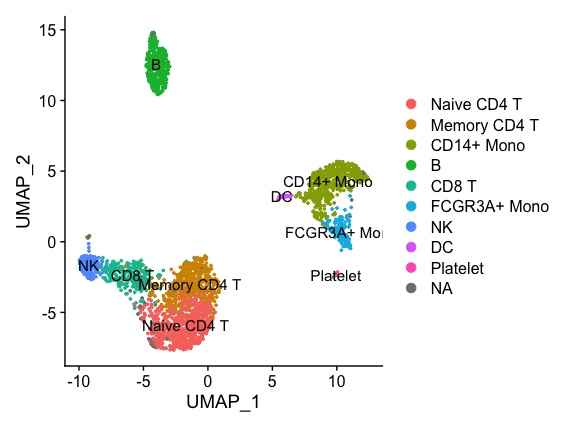

In this section, we'll demonstrate two ways to label cells in our dataset. The steps in this tutorial come from the [SingleR vignette](https://bioconductor.org/packages/devel/bioc/vignettes/SingleR/inst/doc/SingleR.html) and [Seurat Integration Mapping Vignette](https://satijalab.org/seurat/articles/integration_mapping.html), and are applied here to our workshop dataset.

To start, we load our library path, libraries and set our working directory:
```R
LIB='/cluster/tufts/hpc/tools/R/4.0.0/'
.libPaths(c("",LIB))
library(tidyverse)
library(Seurat)
library(SingleR)
library(celldex)
library(pheatmap)
setwd("~/intro_to_scrnaseq/")
```
We begin by loading our integrated samples.
```R
seurat_integrated = readRDS("results/integrated_seurat.rds")
```

Set our identities to be the clusters found at the resolution 0.4 and plot UMAP:
```R
Idents(object = seurat_integrated) <- "integrated_snn_res.0.4"
DimPlot(seurat_integrated, label=T)
```

Set our identities to be the sample type and plot UMAP:
```R
Idents(object = seurat_integrated) <- "sample"
DimPlot(seurat_integrated)
```


## Correlation Method (SingleR) 
We'll use the [SingleR](https://github.com/LTLA/SingleR) tool with a reference database of expression profiles of known cell types in order to identify our cells and clusters. As mentioned in the lecture, this method measures the correlation of overall gene expression between cells in a reference database with cells in the query dataset in order to label cells  


To start, we'll use a general database of Human pure cell-types called the Human Primary Cell Type Atlas.  This dataset along with several others is available through the [celldex](https://rdrr.io/github/LTLA/celldex/man/HumanPrimaryCellAtlasData.html) R library. To load:
```R
hpca = HumanPrimaryCellAtlasData()
```

The HPCA object is of the data type called a `Summarized Experiment` which allows one to store count data matrices in assays along with metadata which annotate each cell/sample in the count data.

```R
head(hpca)
```

!!! info "output"
```R
class: SummarizedExperiment 
dim: 6 713 
metadata(0):
assays(1): logcounts
rownames(6): A1BG A1BG-AS1 ... A2M-AS1 A2ML1
rowData names(0):
colnames(713): GSM112490 GSM112491 ... GSM92233 GSM92234
colData names(3): label.main label.fine label.ont
```

Summarized Experiments have the following form (NOTE fig ref, maybe we covered this already https://bioconductor.org/packages/release/bioc/html/SummarizedExperiment.html)


Well use in particular the label.main column of the metadata, which has the following cell-types:

```R
unique(hpca$label.main)
```

!!! info "output"
```R
 [1] "DC"                   "Smooth_muscle_cells"  "Epithelial_cells"     "B_cell"              
 [5] "Neutrophils"          "T_cells"              "Monocyte"             "Erythroblast"        
 [9] "BM & Prog."           "Endothelial_cells"    "Gametocytes"          "Neurons"             
[13] "Keratinocytes"        "HSC_-G-CSF"           "Macrophage"           "NK_cell"             
[17] "Embryonic_stem_cells" "Tissue_stem_cells"    "Chondrocytes"         "Osteoblasts"         
[21] "BM"                   "Platelets"            "Fibroblasts"          "iPS_cells"           
[25] "Hepatocytes"          "MSC"                  "Neuroepithelial_cell" "Astrocyte"           
[29] "HSC_CD34+"            "CMP"                  "GMP"                  "MEP"                 
[33] "Myelocyte"            "Pre-B_cell_CD34-"     "Pro-B_cell_CD34+"     "Pro-Myelocyte" 
```

Our data to be labeled is input into SingleR as a normalized count matrix, which we can extract from the `RNA` assay our `seurat_integrated` object:
```R
query_counts = seurat_integrated@assays$RNA@data
```

SingleR can be run both on the cluster level and the individual cell level. For cluster-level annotation, the average expression profile of each cluster is used and a single label is generated. This is much faster to run, so we'll start here.

```R
query_clusters = seurat_integrated@meta.data$integrated_snn_res.0.4
```

The following command runs SingleR on the cluster level, which should take only a few seconds. We'll save the result to a file.
```R
pred_cluster <- SingleR(test = query_counts,
                        ref = hpca,
                        assay.type.test="logcounts",
                        clusters = query_clusters,
                        labels = hpca$label.main, 
                        prune=F)

saveRDS(pred_cluster, "results/singler_hpca_cluster_res0.4.rds")
```

We can view the results, which contain a score for every cell type plus the final label:
```R
view(pred_cluster)
```

The scores can be plotted as a heatmap:
```R
plotScoreHeatmap(pred_cluster,
                 show_colnames = TRUE)
```


Now, add the labels to the Seurat object:
# todo may need to break this up
```R
new_names = pred_cluster$labels
names(new_names) = rownames(pred_cluster)
seurat_integrated = RenameIdents(seurat_integrated, 
                                 new_names)
seurat_integrated$labels = Idents(seurat_integrated)
```

Let's look at the labeled clusters:
```R
Idents(seurat_integrated) = "labels"
DimPlot(seurat_integrated, label=T)
```


Running on the individual cell level will take longer, so we'll run it as a batch job. To do this, navigate to our scripts directory and open `singler_cell.R`. This file contains the key steps above, but eliminates the `labels` argument from the SingleR command.

```R
pred_cluster <- SingleR(test = query_counts,
                        ref = hpca,
                        assay.type.test="logcounts",
                        clusters = query_clusters)

saveRDS(pred_cluster, "results/singler_hpca_cell.rds")
```

To run it, we use the `run_r_script.sh` script in the `scripts` directory. Click to open the file:
#todo change partition
```bash
#!/bin/bash
#SBATCH -J run_r_script
#SBATCH --partition=patralab
#SBATCH --time=2:00:00 
#SBATCH -n 1
#SBATCH -N 1
#SBATCH --mem=10Gb
#SBATCH --output=%j.out 
#SBATCH --error=%j.err 
 
module purge
module load R/4.0.0

Rscript --no-save $1
```

This takes as an argument our script to be run, which is automatically assigned to the `$1` variable by the shell interpreter. 

To run it, click on `Terminal` next to `Console` in the bottom portion of the Rstudio application and type `sbatch run_rscript.sh singler_cell.R`. Press enter and your job will be given a number by slurm and placed in the queue.


To check the status of your job, type `squeue -u tufts-username` and you will see your job status.

While that is running, we can examine the results of the cluster level predictions. They are:
```R
head(pred_cluster)
```
!!! info "output"


First, let's add the pruned.labels to the `seurat_integrated` metadata by creating a named list `cluster_labels`:
```R
cluster_labels = pred_cluster$labels
names(cluster_labels) = rownames(pred_cluster)
```

The active identities can be renamed:
```R
seurat_integrated = RenameIdents(seurat_integrated, 
                                 new_names)
```

Now we can view the labeled clusters:
```R
DimPlot(seurat_integrated, label=T)
```


Now, take a look at the cell level labels which should be done running by now. We'll this time, we'll add the `pruned labeles` to the seurat object metadata. Note we add it directly to the metadata because it has one entry for each cell.
# todo better explain
```
seurat_integrated  = AddMetaData(seurat_integrated,
                                 pred$pruned.labels,
                                 "hpca.labels")
```

```R
Idents(seurat_integrated) = "hpca.labels"
DimPlot(seurat_integrated, label=T)
```


We see the picture is more complex and clusters containing a mix of cell labels. We can view the breakdown per cluster as a heatmap:
```R
tab <- table(cluster=seurat_integrated$integrated_snn_res.0.4, label=pred$labels)
pheatmap(log10(tab+10)) 
```


Clusters 10 and cluster 5 appear to have a mix of cells, which may indicate that they contain a type of cell not in our reference database. This is expected since we've used a very general database. Next we'll use a single-cell RNAseq dataset that contains a perfect match and see how the labeling changes.


## Integration Mapping Method (Seurat)

These are PBMC from another source, processed through the Seurat pipeline as our data. Let's load and view the metadata:
```R
pbmc = readRDS("data/pbmc3k_tutorial.rds")
head(pbmc)
```
!!! info "output"
```R
              orig.ident nCount_RNA nFeature_RNA seurat_annotations percent.mt RNA_snn_res.0.5 seurat_clusters
AAACATACAACCAC     pbmc3k       2419          779       Memory CD4 T  3.0177759               0               0
AAACATTGAGCTAC     pbmc3k       4903         1352                  B  3.7935958               3               3
AAACATTGATCAGC     pbmc3k       3147         1129       Memory CD4 T  0.8897363               2               2
AAACCGTGCTTCCG     pbmc3k       2639          960         CD14+ Mono  1.7430845               5               5
AAACCGTGTATGCG     pbmc3k        980          521                 NK  1.2244898               6               6
AAACGCACTGGTAC     pbmc3k       2163          781       Memory CD4 T  1.6643551               2               2
AAACGCTGACCAGT     pbmc3k       2175          782              CD8 T  3.8160920               4               4
AAACGCTGGTTCTT     pbmc3k       2260          790              CD8 T  3.0973451               4               4
AAACGCTGTAGCCA     pbmc3k       1275          532        Naive CD4 T  1.1764706               4               4
AAACGCTGTTTCTG     pbmc3k       1103          550       FCGR3A+ Mono  2.9011786               5               5
```

Set the identities and plot
```R
Idents(pbmc) = "seurat_annotations"
DimPlot(pbmc, label=T)
```


Make normalization methods agree:
```R
pbmc <- SCTransform(pbmc, verbose = TRUE)
```

Find the transfer anchors:
```R
anchors <- FindTransferAnchors(reference = pbmc, 
                                   query = seurat_integrated,
                                   reduction = "pcaproject",
                                   reference.reduction = "pca",
                                   dims = 1:30)
```

Make cell type predictions by transfering the anchors:
```R
predictions<- TransferData(anchorset = anchors, 
                                refdata = pbmc$seurat_annotations,
                                dims = 1:30)
```

```R
                     predicted.id prediction.score.Memory.CD4.T prediction.score.B prediction.score.CD14..Mono prediction.score.NK prediction.score.CD8.T
ctrl_AAACATACAATGCC-1  Naive CD4 T                     0.1323132        0.000000000                   0.0000000                   0            0.003698254
ctrl_AAACATACATTTCC-1   CD14+ Mono                     0.0000000        0.000000000                   0.6617589                   0            0.000000000
ctrl_AAACATACCAGAAA-1   CD14+ Mono                     0.0000000        0.000000000                   0.8092495                   0            0.000000000
ctrl_AAACATACCAGCTA-1   CD14+ Mono                     0.0000000        0.000000000                   0.7856636                   0            0.000000000
ctrl_AAACATACCATGCA-1  Naive CD4 T                     0.1106743        0.005805717                   0.0000000                   0            0.015044274
ctrl_AAACATACCTCGCT-1   CD14+ Mono                     0.0000000        0.000000000                   0.8502115                   0            0.000000000
                      prediction.score.Naive.CD4.T prediction.score.FCGR3A..Mono prediction.score.DC prediction.score.Platelet prediction.score.max
ctrl_AAACATACAATGCC-1                    0.8639886                     0.0000000           0.0000000                         0            0.8639886
ctrl_AAACATACATTTCC-1                    0.0000000                     0.1643801           0.1624098                         0            0.6617589
ctrl_AAACATACCAGAAA-1                    0.0000000                     0.1609336           0.0000000                         0            0.8092495
ctrl_AAACATACCAGCTA-1                    0.0000000                     0.1046896           0.0000000                         0            0.7856636
ctrl_AAACATACCATGCA-1                    0.8624720                     0.0000000           0.0000000                         0            0.8624720
ctrl_AAACATACCTCGCT-1                    0.0000000                     0.1220872           0.0000000                         0            0.8502115
```

Add the predicted id to the metadata:
```R
seurat_integrated <- AddMetaData(seurat_integrated, 
                                 metadata = predictions)
```

Set the Idents and plot:
```R
Idents(seurat_integrated) = "predicted.id"
DimPlot(seurat_integrated, label=T )
```


We can view the breakdown per cluster as a heatmap:
```R
tab <- table(cluster=seurat_integrated$integrated_snn_res.0.4, label=seurat_integrated$predicted.id)
pheatmap(log10(tab+10)) 
```


Now it is more clear that cluster 5 is CD8-T and cluster 10 is Dendritic Cells. 
