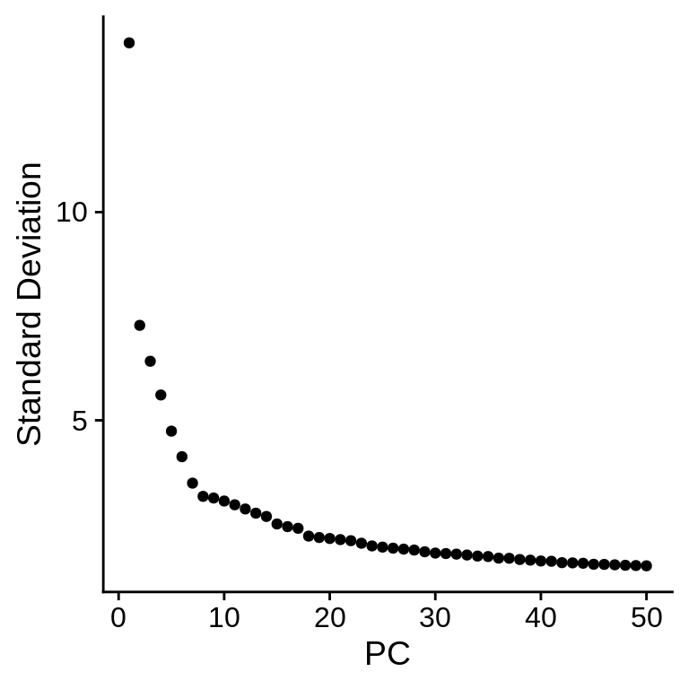
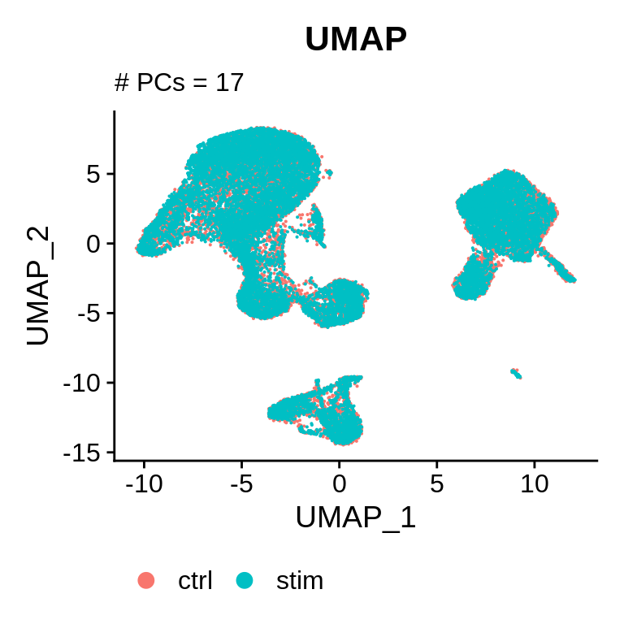
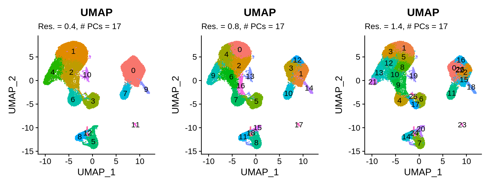
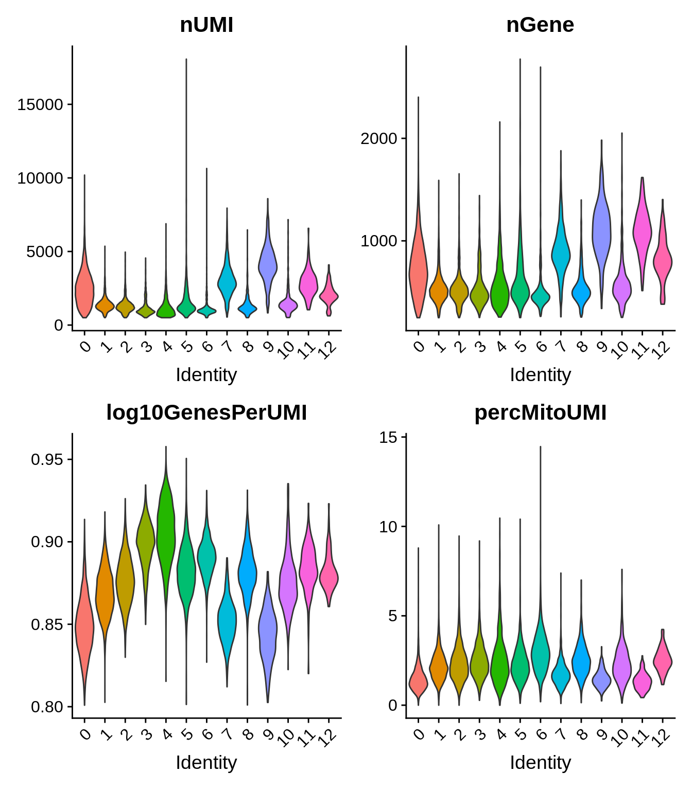
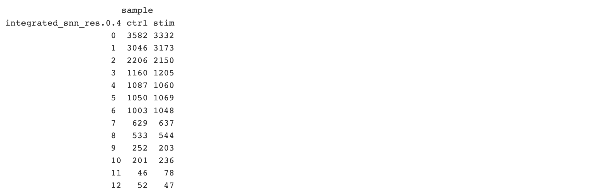

# Single Cell RNA Sequencing Clustering

In this section we will describe procedures for clustering scRNAseq.

We will perform these procedures on our two-sample combined, formatted, QC'd, and integrated PBMC scRNAseq data set [`Seurat`] object generated in the previous sections. Portions of this section have been adapted from previous Tufts HPC workshops describing [clustering](https://hbctraining.github.io/scRNA-seq_online/lessons/07_SC_clustering_cells_SCT.html) and [clustering quality control](https://hbctraining.github.io/scRNA-seq_online/lessons/07_SC_clustering_cells_SCT.html).

## Setting up R environment

We begin by setting up our R environment similar to the previous sections.

### R library source

We will be reading in and writing files relative to our `intro_to_scrnaseq`. For simplicity, we will create an R object that is simply a character string that gives this path, and use it as a prefix for reading and writing files.

```R
LIB='/cluster/tufts/hpc/tools/R/4.0.0/'
.libPaths(c("",LIB))
```

### Read in R packages

For this section, requires three R packages:

1. `Seurat` : A package for working with and analysis of scRNAseq data. Comprehensive tutorials for available analyses with the `Seurat` R package are available on the project [website](https://satijalab.org/seurat/).
2. `ggplot2`: The standard package for creating plots in R. Much of the plotting functions are wrappers for `ggplot2` functionality.
3. `cowplot` : A nice package for combining plots into a single figure. Specifically we will make use of of the `plot_grid()` function.

```R
library(Seurat)
library(ggplot2)
library(cowplot)
```

### Set base directory

```R
baseDir <- "~/intro_to_scrnaseq/"
```

## Read in integrated `Seurat` object

```R
integ_seurat <- readRDS(file.path(baseDir, "data/integrated_seurat.rds"))
```

## Choosing the number of principal components for clustering

```R
integ_seurat <- RunPCA(integ_seurat)
```

```R
ElbowPlot(integ_seurat, ndims = 50)
```



```R
integ_seurat <- RunUMAP(integ_seurat, dims = seq(17))
```

```R
uPlot_dim17 <- UMAPPlot(integ_seurat, group.by = "sample") +
  ggtitle("UMAP",
          subtitle = "# PCs = 17") +
  theme(
    legend.position = "bottom"
  )

uPlot_dim17
```



## Determine the K-nearest neighbor graph

```{r}
integ_seurat <- FindNeighbors(object = integ_seurat, 
                                   dims = seq(17))
```

## Determine the clusters for various resolutions

```{r}
# Determine the clusters for various resolutions                                
integ_seurat <- FindClusters(object = integ_seurat,
                                  resolution = c(0.4, 0.6, 0.8, 1.0, 1.4))
```

## Plot clusters at different resolutions

```R
uPlotCl0p4 <- UMAPPlot(integ_seurat, group.by = "integrated_snn_res.0.4", label = TRUE) +
  ggtitle("UMAP", 
          subtitle = "Res. = 0.4, # PCs = 17") +
  theme(
    legend.position = "none"
  )

uPlotCl0p8 <- UMAPPlot(integ_seurat, group.by = "integrated_snn_res.0.8", label = TRUE) +
  ggtitle("UMAP", 
          subtitle = "Res. = 0.8, # PCs = 17") +
  theme(
    legend.position = "none"
  )

uPlotCl1p4 <- UMAPPlot(integ_seurat, group.by = "integrated_snn_res.1.4", label = TRUE) +
  ggtitle("UMAP", 
          subtitle = "Res. = 1.4, # PCs = 17") +
  theme(
    legend.position = "none"
  )

plot_grid(uPlotCl0p4, uPlotCl0p8, uPlotCl1p4, nrow = 1)
```



## Inspecting cluster results

### Visualize distributions of QC variables in clusters

```R
VlnPlot(integ_seurat, 
        group.by = "integrated_snn_res.0.4", 
        features = c("nUMI", "nGene", "log10GenesPerUMI", "percMitoUMI"), 
        ncol = 1)
```



### Check cell cluster assignments accross samples

```R
table(integ_seurat[[c("integrated_snn_res.0.4", "sample")]])
```


## Save seurat object

```R
saveRDS(integ_seurat, file.path(baseDir, "data/clustered_seurat.rds"))
```