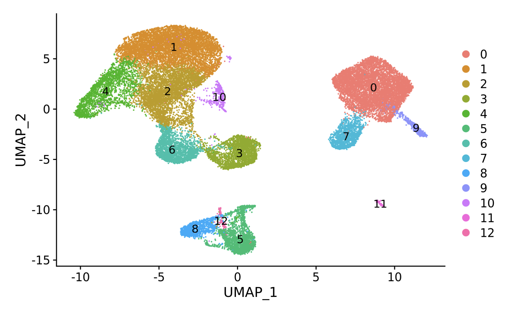
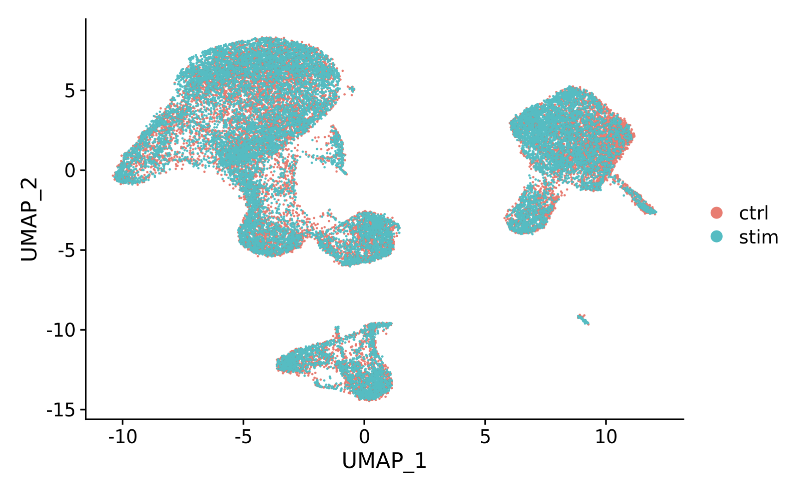
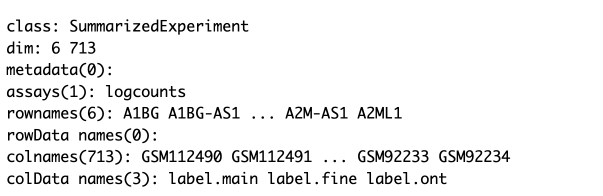

# Cell-type Identification [DRAFT]
In this section, we'll demonstrate two ways to label cells in our dataset. 

- [SingleR](https://bioconductor.org/packages/devel/bioc/vignettes/SingleR/inst/doc/SingleR.html) method, which uses correlation of gene expression   
- [Seurat Integration Mapping](https://satijalab.org/seurat/articles/integration_mapping.html) which uses an integration method that is very similar to the one we used to integrate our two samples.

To start, we set our library path:
```R
LIB='/cluster/tufts/hpc/tools/R/4.0.0/'
.libPaths(c("",LIB))
```

We require three new packages:
1) Singler
2) celldex
3) pheatmap

```R
suppressPackageStartupMessages({
  library(tidyverse)
  library(Seurat)
  library(SingleR)
  library(celldex)
  library(pheatmap)
})
```

Set the base dir:
```R
baseDir <- "~/intro_to_scrnaseq/"
```

We begin by loading our integrated samples.

```R
integ_seurat = readRDS(file.path(baseDir, "data/clustered_seurat.rds"))
```

Set our identities to be the clusters found at the resolution 0.4 and plot UMAP: 
```R
Idents(object = integ_seurat) <- "integrated_snn_res.0.4"
DimPlot(integ_seurat, label=T)
```


Set our identities to be the sample type and plot UMAP:
```R
Idents(object = integ_seurat) <- "sample"
DimPlot(integ_seurat)
```

## Correlation Method (SingleR) 
We'll use the [SingleR](https://github.com/LTLA/SingleR) tool with a reference database of expression profiles of known cell types in order to identify our cells and clusters. As mentioned in the lecture, this method measures the correlation of overall gene expression between cells in a reference database with cells in the query dataset in order to label cells  

To start, we'll use a general database of Human pure cell-types called the Human Primary Cell Type Atlas.  This dataset along with several others is available through the [celldex](https://rdrr.io/github/LTLA/celldex/man/HumanPrimaryCellAtlasData.html) R library. To load:
```R
hpca = HumanPrimaryCellAtlasData()
```

The HPCA object is of the data type called a `Summarized Experiment` which allows one to store count data matrices in assays along with metadata which annotate each cell/sample in the count data.

```R
head(hpca)
```


Well use in particular the label.main column of the metadata, which has the following cell-types:

```R
unique(hpca$label.main)
```


Our data to be labeled is input into SingleR as a normalized count matrix, which we can extract from the `RNA` assay our `integ_seurat` object:
```R
query_counts = integ_seurat@assays$RNA@data
```

SingleR can be run both on the cluster level and the individual cell level. For cluster-level annotation, the average expression profile of each cluster is used and a single label is generated. This is much faster to run, so we'll start here.

```R
query_clusters = integ_seurat@meta.data$integrated_snn_res.0.4
```

The following command runs SingleR on the cluster level, which should take only a few seconds. 
```R
pred_cluster <- SingleR(test = query_counts,
                        ref = hpca,
                        assay.type.test="logcounts",
                        clusters = query_clusters,
                        labels = hpca$label.main, 
                        prune=F)
```

Save the results:
```R
saveRDS(pred_cluster, file.path(baseDir, "results/singler_hpca_cluster_res0.4.rds"))
```

We can view the results, which contain a score for every cell type plus the final label:
```R
view(pred_cluster)
```

Select the score data to plot as a heatmap and the `label` column to annotate:
```R
scores = data.frame(pred_cluster) %>%
  dplyr::select(starts_with("scores")) 

labels = data.frame(pred_cluster) %>%
  dplyr::select("labels")
```

The scores can be plotted as a heatmap:
```R
pheatmap(scores,
         annotation_row = labels) 
```


Now, make a named list with new names:
```R
new_names = pred_cluster$labels
names(new_names) = rownames(pred_cluster)
new_names
```

Set the identities to the clusters found at resolution 0.4, rename the clusters, and add the names to the seurat metadata:
```R
Idents(object = integ_seurat) <- "integrated_snn_res.0.4"
integ_seurat = RenameIdents(integ_seurat, 
                                 new_names)
integ_seurat$labels = Idents(integ_seurat)
```

Let's look at the labeled clusters:
```R
Idents(integ_seurat) = "labels"
DimPlot(integ_seurat, 
        label=T)
```


Running on the individual cell level will take longer, so we'll run it as a batch job. To do this, navigate to our scripts directory and open `singler_cell.R`. This file contains the key steps above, but eliminates the `labels` argument from the SingleR command.

```R
# DO NOT RUN!
pred_cell <- SingleR(test = query_counts,
                      ref = hpca,
                      assay.type.test="logcounts",
                      labels = hpca$label.main)

```

To run it, we use the `run_singler_cell.sh` script in the `scripts` directory. Click to open the file:

```bash
#!/bin/bash
#SBATCH -J run_singler
#SBATCH --time=2:00:00 
#SBATCH -n 1
#SBATCH -N 1
#SBATCH --mem=10Gb
#SBATCH --output=%j.out 
#SBATCH --error=%j.err 
 
module purge
module load R/4.0.0

Rscript --no-save singler_cell.R
```

This contains an sbatch header which gives instructions to the HPC job scheduler, 'slurm', about resources that the job will need. 

To run the script:
- Click on `Terminal` next to `Console` in the bottom portion of the Rstudio application
- Change to our `scripts` directory by typing `cd intro_to_scrnaseq/scripts`
- Type `sbatch run_singler_cell.sh singler_cell.R` and press enter. 
- Your job will be given a number by slurm and placed in the queue.
- To check the status of your job, type `squeue -u tufts-username` and you will see your job status. 

Let's load the prepossessed results in the meantime:
```R
pred_cell = readRDS(file.path(baseDir,"data/singler_hpca_cell.rds"))
```

Take a look at the cell level labels which should be done running by now. We'll this time, we'll add the `pruned labeles` to the seurat object metadata. Note we add it directly to the metadata because it has one entry for each cell.
```R
integ_seurat  = AddMetaData(integ_seurat,
                                 pred_cell$pruned.labels,
                                 "hpca.labels")
```

Assign the idents and make a plot:
```R
Idents(integ_seurat) = "hpca.labels"
DimPlot(integ_seurat, 
        label=T)
```


We see the picture is more complex and clusters containing a mix of cell labels. We can view the breakdown per cluster as a heatmap:
```R
tab <- table(cluster=integ_seurat$integrated_snn_res.0.4,
             label=pred_cell$labels)
pheatmap(log10(tab+10)) 
```


Some clusters appear to have a mix of cells, which may indicate that they contain a type of cell not in our reference database. This is expected since we've used a very general database. Next we'll use a single-cell RNAseq dataset that contains a perfect match and see how the labeling changes.


## Integration Mapping Method (Seurat)

These are PBMC from another source, processed through the Seurat pipeline as our data. Let's load and view the metadata:
```R
pbmc = readRDS(file.path(baseDir, "data/pbmc_reference.rds"))
head(pbmc)
```

Set the identities and plot
```R
Idents(pbmc) = "seurat_annotations"
DimPlot(pbmc, label=T)
```


Find the transfer anchors:
```R
anchors <- FindTransferAnchors(reference = pbmc, 
                                   query = integ_seurat,
                                   reduction = "pcaproject",
                                   reference.reduction = "pca",
                                   dims = 1:30)
```

Make cell type predictions by transfering the anchors:
```R
predictions<- TransferData(anchorset = anchors, 
                                refdata = pbmc$seurat_annotations,
                                dims = 1:30)
```

Add the predicted id to the metadata:
```R
integ_seurat <- AddMetaData(integ_seurat, 
                                 metadata = predictions)
```

Set the Idents and plot:
```R
Idents(integ_seurat) = "predicted.id"
DimPlot(integ_seurat, label=T )
```


We can view the breakdown per cluster as a heatmap:
```R
tab <- table(cluster=integ_seurat$integrated_snn_res.0.4,
             label=integ_seurat$predicted.id)
pheatmap(log10(tab+10)) 
```


Finally, we have to save the labeled object:
```R
saveRDS(integ_seurat, file.path(baseDir,"results/labeled_seurat.rds"))
```