# Cell-type Identification 
In this section, we'll demonstrate two automated methods to label cells in our dataset using reference datasets with known cell labels. More information on these methods is presented in [Lecture Part II](slides/day2_temp.pdf).

- [SingleR](https://bioconductor.org/packages/devel/bioc/vignettes/SingleR/inst/doc/SingleR.html) method, which uses correlation of gene expression. This method can use both single-cell and bulk RNAseq reference datasets. 
- [Seurat Integration Mapping](https://satijalab.org/seurat/articles/integration_mapping.html) which applies integration between a labeled, reference single-cell RNAseq dataset and our query dataset

To start, we set our library path on the HPC cluster:
```R
LIB='/cluster/tufts/hpc/tools/R/4.0.0/'
.libPaths(c("",LIB))
```

We require three new packages:
- [Singler](https://bioconductor.org/packages/release/bioc/html/SingleR.html)
- [celldex](https://bioconductor.org/packages/release/data/experiment/html/celldex.html): A collection of reference expression datasets with cell type labels 
- [pheatmap](https://cran.r-project.org/web/packages/pheatmap/index.html) A package to make "pretty" heatmaps.

```R
suppressPackageStartupMessages({
  library(Seurat)
  library(tidyverse)
  library(cowplot)
  library(SingleR)
  library(celldex)
  library(pheatmap)
})
```

Set the base dir:
```R
baseDir <- "~/intro_to_scrnaseq/"
```

We begin by loading a pre-processed version of our integrated, clustered samples from the `data` folder.
```R
integ_seurat = readRDS(file.path(baseDir, "data/clustered_seurat.rds"))
```

When we left off, we had integrated our unstimulated (`ctrl`) and interferon beta stimulated (`stim`) PBMC samples and clustered the resulting dataset at resolution 0.4. We can visualize the cells both using either cluster or sample labels:
```R
Idents(object = integ_seurat) <- "integrated_snn_res.0.4"
p1 <- DimPlot(integ_seurat, label=T)

Idents(object = integ_seurat) <- "sample"
p2 <- DimPlot(integ_seurat)

plot_grid(p1, p2)
```
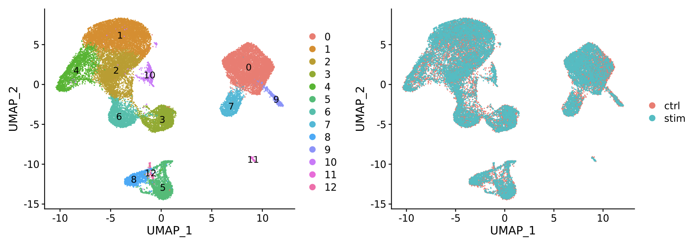


## SingleR Correlation Method 
First, we'll use [SingleR](https://github.com/LTLA/SingleR) along with a reference database of expression profiles of known cell types in order to identify our cells and clusters. As mentioned in the lecture, this method measures the correlation of overall gene expression between cells in a reference database with cells in the query dataset in order to label cells.

To start, we'll use a database of bulk RNAseq profiles of Human pure cell-types called the Human Primary Cell Type Atlas.  This dataset along with several others is available through the [celldex](https://rdrr.io/github/LTLA/celldex/man/HumanPrimaryCellAtlasData.html) R library. A database like this is useful as a starting point to determine which broad cell types your sample has, either because there is no existing single-cell reference for your sample-type, or because you want to make sure that your sample-type contains the expected cell types before using a more specific single-cell reference. 


To load, type the following, and type `yes` when prompted to create the `ExperimentHub` directory in a hidden `.cache` directory in your home folder.
```R
hpca = HumanPrimaryCellAtlasData()
```
The HPCA object has a data type called `Summarized Experiment` which allows one to store numeric data matrices in `assays` along with a data.frame providing annotation columns for sample in the data. 

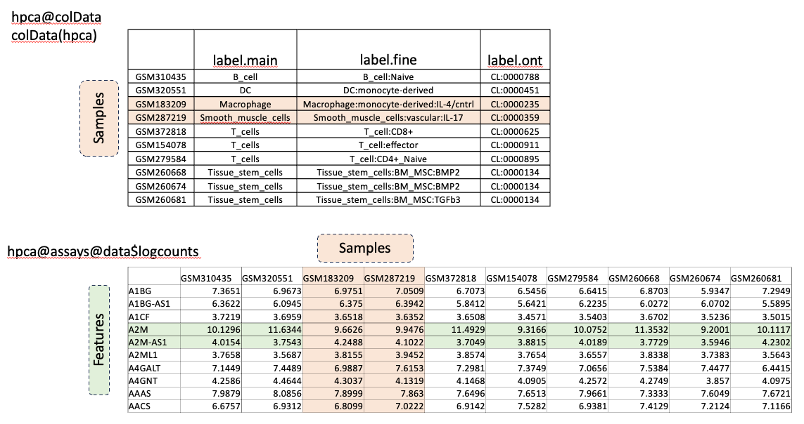

We can access the sample annotations in the `@colData` slot, which show the sample cell-types. We can access the log-transformed expression data in the `@assay` slot.
```R
head(hpca@colData)
head(hpca@assays@data$logcounts)
```

Well use the coarse-grained cell-type labels, `label.main`, column of the metadata, which has the following cell-types:
```R
unique(hpca$label.main)
```
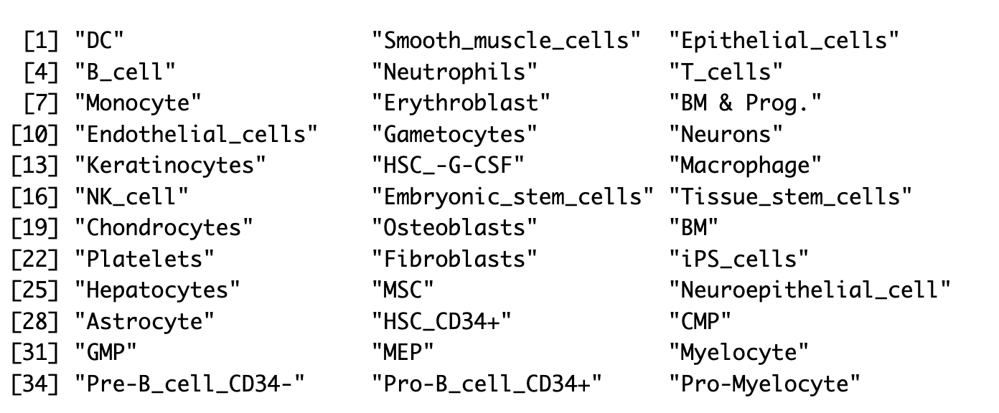

The data to be labeled is input into SingleR as a log-transformed, normalized count matrix, which we can extract from the `RNA` assay our `integ_seurat` object:
```R
query_counts = integ_seurat@assays$RNA@data
```

`SingleR` can be run both on the cluster level and the individual cell level. For cluster-level annotation, the average expression profile of each cluster is used and a single label is generated. This is much faster to run, since we have many fewer clusters than cells, so we'll start here.

```R
query_clusters = integ_seurat@meta.data$integrated_snn_res.0.4
```

The following command runs SingleR on the cluster level, without pruning, which should take only a few seconds.
```R
pred_cluster <- SingleR(test = query_counts,
                        clusters = query_clusters,
                        ref = hpca,
                        labels = hpca$label.main, 
                        prune=F)
```

Save the results:
```R
saveRDS(pred_cluster, file.path(baseDir, "results/singler_hpca_cluster_res0.4.rds"))
```

We can view the results, which contain a score for every cell type plus the final label:
```R
view(pred_cluster)
```

Select the columns that start with `score` to plot as a heatmap and the `label` column to annotate the heatmap:
```R
scores = data.frame(pred_cluster) %>%
  dplyr::select(starts_with("scores")) 

labels = data.frame(pred_cluster) %>%
  dplyr::select("labels")
```

The scores and chosen labels can be plotted using `pheatmap`:
```R
pheatmap(scores,
         annotation_row = labels) 
```
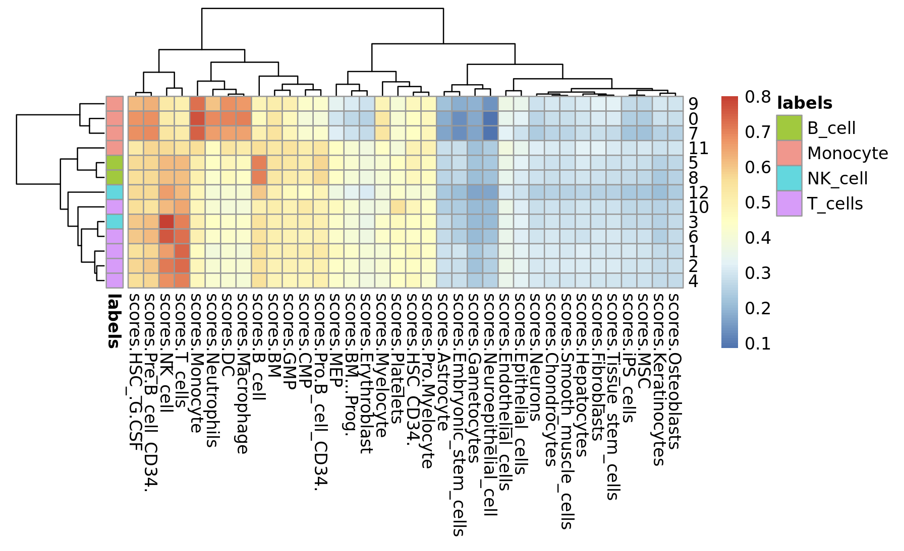

Four cell-types were found in our data: B_cell, Monocyte, NK_cell and T_cell. However, some clusters like 10, 11, 12, do not appear to have a good match for any reference cell type.  

Let's add the labels make a named list with new names:
```R
new_names = pred_cluster$labels
names(new_names) = rownames(pred_cluster)
new_names
```
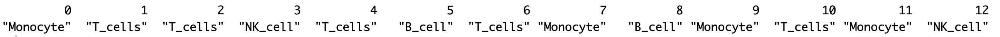

Set the identities to the clusters found at resolution 0.4, rename the identities, and add the names to the Seurat metadata:
```R
Idents(object = integ_seurat) <- "integrated_snn_res.0.4"
integ_seurat = RenameIdents(integ_seurat, 
                                 new_names)
integ_seurat$singler_cluster_labels = Idents(integ_seurat)
```

Plot the labeled clusters:
```R
Idents(integ_seurat) = "singler_cluster_labels"
DimPlot(integ_seurat, 
        label=T)
```
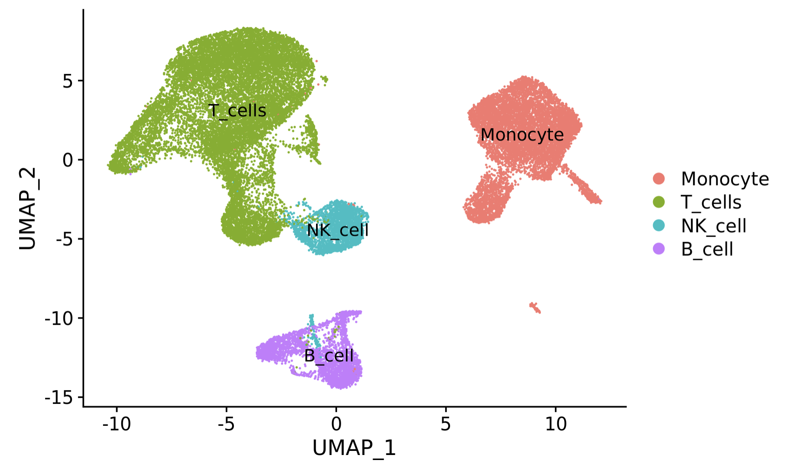

Running `SingleR` on the cell level uses the same method but eliminates the `clusters` argument from the command and enables the default pruning process. It will take ~20 minutes to run, so we'll run it as a batch job and not interactively (do not run the below code in Rstudio).

```{R,eval=FALSE}
# DON'T RUN!
pred_cell <- SingleR(test = query_counts,
                      ref = hpca,
                      assay.type.test="logcounts",
                      labels = hpca$label.main)

```
Running R scripts as batch job is convenient and does not require the Rstudio session to remain connected while the job runs. To navigate to our scripts directory and open `06_singler_cell.R`. This file contains the key steps above but runs `SingleR` on the cell level.

To run it, we use an `SBATCH` file that is interpreted by the cluster job scheduler called [slurm](https://tufts.app.box.com/file/780443358198?v=Pax-User-Guide). Open the file `06_run_singler_cell.sh` in the `scripts` directory. 

The file contains a header which specifies the resources that the job will need so that an appropriate compute node can be allocated. Header lines start with `#SBATCH`. The body of the script specifies the code to be run once the job is started on a compute node. 

```bash
#!/bin/bash                       # Use the bash shell interpreter
#SBATCH -J run_singler            # Give the job a name
#SBATCH --time=2:00:00            # Request 2 hours
#SBATCH -n 1                      # Request 1 core
#SBATCH -N 1                      # Request 1 node
#SBATCH --mem=10Gb                # Request 10 Gb
#SBATCH --output=%j.out           # Write the job output to a file prefixed by the job number
#SBATCH --error=%j.err            # Write the job error to a file prefixed by the job number
 
module purge                      # Remove loaded modules
module load R/4.0.0               # Load R module

Rscript --no-save 06_singler_cell.R  # Run the script 
```

To run the script:
- Click on `Terminal` next to `Console` in the bottom portion of the `Rstudio` application
- Change to our `scripts` directory by typing `cd ~/intro_to_scrnaseq/scripts`
- Type `sbatch 06_run_singler_cell.sh` and press enter. 
- Your job will be given a number by `slurm` and placed in the queue.
- To check the status of your job, type `squeue -u tufts-username` and you will see your job status. 

??? question "Is your job submitted successfully?"
    - Yes (put up a green check mark in zoom)
    - No (raise hand in zoom)
    
In the meantime, let's load the pre-processed cell-level labels.
```R
pred_cell = readRDS(file.path(baseDir,"data/singler_hpca_cell.rds"))
head(pred_cell)
```
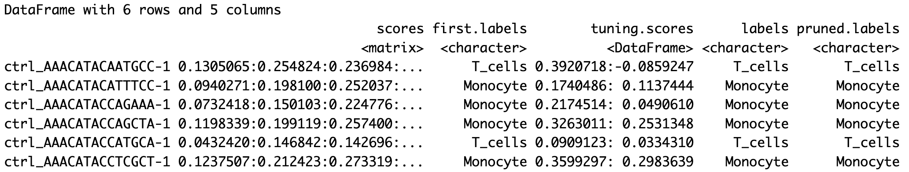

The cell-level labels have one row for every cell. The table contains scores for each reference label as well as both a `labels` and a `pruned.labels` column. We can directly add the `pruned.labels` to the Seurat object metadata using the `AddMetaData` function. 

```R
integ_seurat  = AddMetaData(integ_seurat,
                                 pred_cell$pruned.labels,
                                 col.name = "singler_cell_labels")
```

Assign the idents and make a plot:
```R
Idents(integ_seurat) = "singler_cell_labels"
DimPlot(integ_seurat, 
        label=T)
```
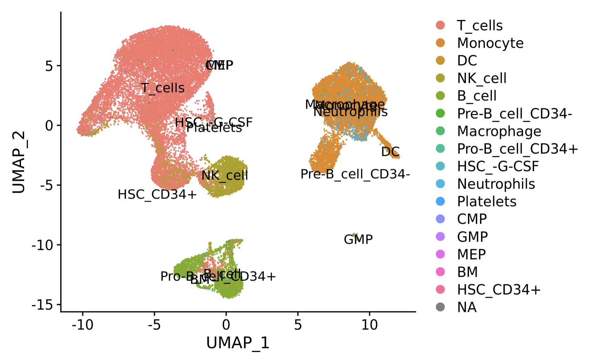

Some clusters contain a mix of cell labels. We can view the breakdown of cell-type labels per cluster using pheatmap:
```R
tab <- table(cluster=integ_seurat$integrated_snn_res.0.4,
             label=pred_cell$labels)

# divide by the total number of cells in each cluster
tab <- tab/rowSums(tab)

pheatmap(tab) 
```
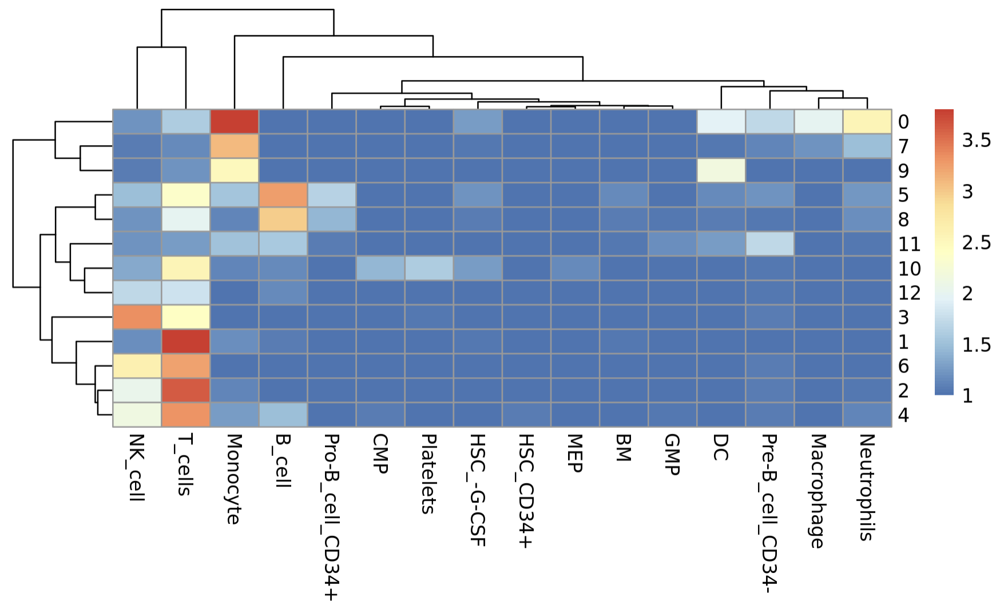

??? question "Are the dominant cell-level labels the same as the cluster-level labels?" 
    - Add a row annotation of the cluster-level labels in order to compare visually
    
Some clusters appear to have a mix of cells, which may indicate that they contain a type of cell not in our reference database. This is expected since we've used a very general database. Next we'll use a single-cell RNAseq dataset that we expect will have a better match to our data.

## Seurat Integration Mapping

The next reference dataset is a PBMC dataset [available from 10X Genomics](https://cf.10xgenomics.com/samples/cell/pbmc3k/pbmc3k_filtered_gene_bc_matrices.tar.gz) which has been pre-processed through the Seurat pipeline. Load the data:
```R
pbmc = readRDS(file.path(baseDir, "data/pbmc_reference.rds"))
```

The cell-type label is in the `seurat_annotation` metadata column. Set the cell identities to this column and plot:
```R
Idents(pbmc) = "seurat_annotations"
DimPlot(pbmc, label=T)
```

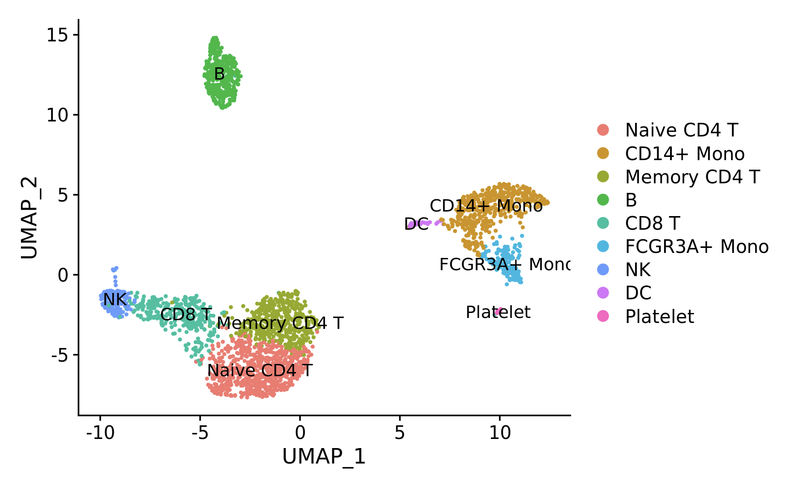

We see there are more specific T-cell and Monocyte cell subset labels. 

The first step is to find the transfer anchors using the function `FindTransferAnchors` with the following code. This step similar to the `FindIntegrationAnchors` function in the integration step, except the PCA is performed only on the reference dataset and the query dataset is projected onto the reference learned PCA structure (`reduction = "pcaproject"` and `project.query = FALSE` by default). This allows us to potentially use a reference dataset with many more cell types than our query dataset. 

```R
anchors <- FindTransferAnchors(reference = pbmc, 
                                   query = integ_seurat)
```

Next, we'll transfer the reference cell-type labels to the query using `TransferData`. This step uses the proximity of each query cells to each anchors in order to label query cells.
```R
predictions<- TransferData(anchorset = anchors, 
                                refdata = pbmc$seurat_annotations)
```

Add the predicted id to the metadata:
```R
integ_seurat <- AddMetaData(integ_seurat, 
                                 metadata = predictions$predicted.id,
                                 col.name = "seurat_labels")
```

Set the identities to our newly added column and plot:
```R
Idents(integ_seurat) = "seurat_labels"
DimPlot(integ_seurat, 
            label=T )
```

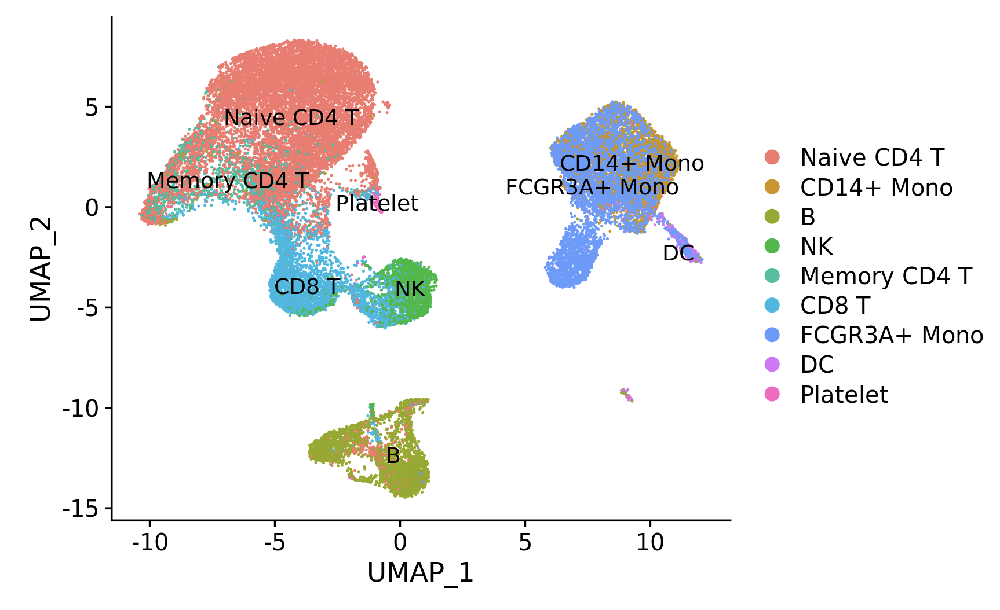

We can view the breakdown per cluster as a heatmap:
```R
tab <- table(cluster=integ_seurat$integrated_snn_res.0.4,
             label=integ_seurat$seurat_labels)

# divide by the total number of cells in each cluster
tab <- tab/rowSums(tab)

pheatmap(tab) 
```

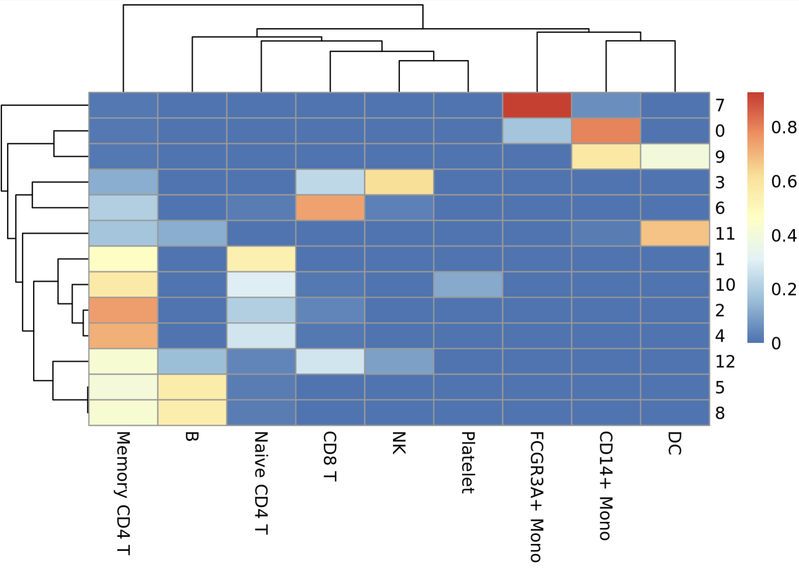

Cluster 11 cells are labeled predominantly Dendritic Cells. 

Finally, we save the labeled object:
```R
saveRDS(integ_seurat, file.path(baseDir,"results/labeled_seurat.rds"))
```

In the next section we'll look at a type of Differentially Expressed Gene known as a Marker Gene, which can help to confirm cell-type labels by confirming expression of known cell-type specific genes.