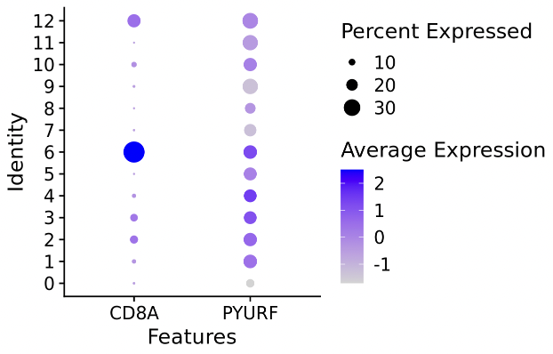
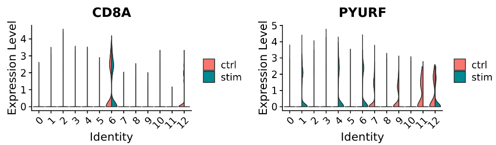
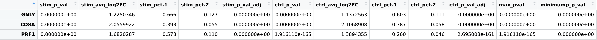
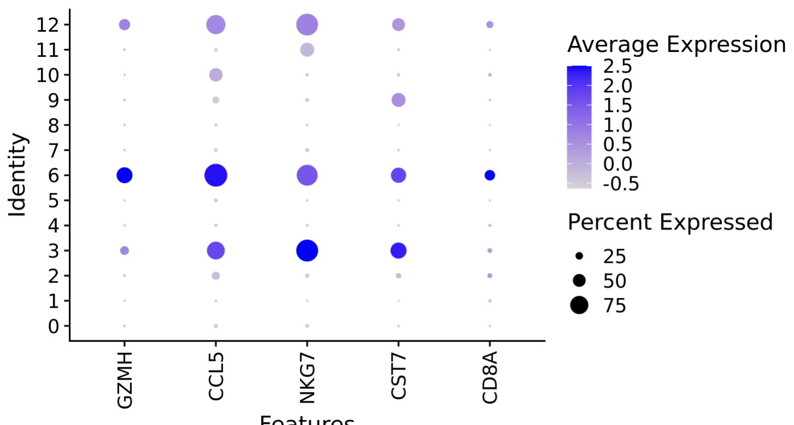
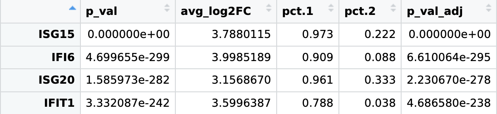
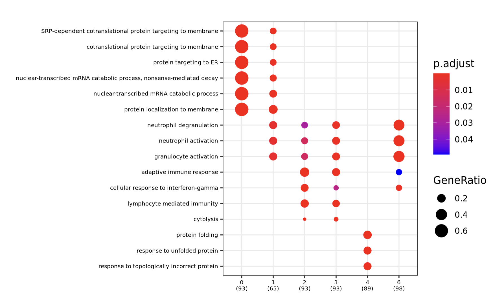

# Differential Expression [DRAFT]

In this section we will identify differentially expressed genes. This a complementary method to understanding the biological meaning of our clusters.

Differential Expression in scRNAseq has multiple meanings. Here we focus on two types:
- Genes that are overexpressed in on cell-type compared to all other cell-types, known as "Marker Genes"
- Genes that are statistically different between groups of cells with different phenotypes or conditions, known as "Differentially Expressed Genes"


To start, we set our library path:
```R
LIB='/cluster/tufts/hpc/tools/R/4.0.0/'
.libPaths(c("",LIB))
```

We load our packages:

```R
suppressPackageStartupMessages({
  library(tidyverse)
  library(cowplot)
  library(Seurat)
})
```

Set the base dir:
```R
baseDir <- "~/intro_to_scrnaseq/"
```

We begin by loading the integrated, clustered, and labeled cells from `results`, created in the last section. One may alternatively load the integrated, clustered object from `data`.

```R
integ_seurat = readRDS(file.path(baseDir, "results/labeled_seurat.rds"))
```

We again set identities to be the clusters found at the resolution 0.4 and set our default assay to be `RNA`:
```R 
Idents(object = integ_seurat) <- "integrated_snn_res.0.4"
DefaultAssay(integ_seurat) = "RNA"
```

Next, use a `DotPlot` to visualize expression of genes `CD8A` and `PYURF`. 
```R
DotPlot(integ_seurat, 
         features = c("CD8A","PYURF"))
```


`DotPlot` is a useful as it allows us to visualize both percent of cells in a cluster that express a gene ( above 0 expression), as well as the average expression of the gene in a cluster. Notice that `CD8A` is more highly expressed in cluster 6 compared with other clusters and is therefore likely to be a marker gene for cluster 6. `PYURF` expression, on the other hand, is not cluster-specific. 

Next, examine the expression of these two genes in our two conditions using `VlnPlot`.

```R

vln1 <- VlnPlot(integ_seurat, 
        features = "CD8A",
        split.by = "sample",
        split.plot = TRUE, 
        pt.size = 0)
    
vln2 <- VlnPlot(integ_seurat, 
        features = "PYURF",
        split.by = "sample",
        split.plot = TRUE, 
        pt.size = 0)

plot_grid(vln1, vln2, ncol = 2)

```


`VlnPlot` gives more detail about the distribution of expression levels and can be useful for comparing conditions. On the left we see that `CD8A` it is equally overexpressed in cluster 6 cells in the `ctr` and `stim` samples, while on the right we see that `PYURF` on the other hand seems to have condition-specific expression in several clusters, including cluster 6, and is likely differentially expressed by condition.

## Marker Genes
We will use `FindConservedMarkers` to find the markers of cluster 6 that are overexpressed in both conditions compared to all other clusters.

```R
markers_6 = FindConservedMarkers(integ_seurat,
                                         ident.1 = 6,
                                         grouping.var = "sample",
                                         only.pos = TRUE)
```  

Some additional parameters that we use the defaults are:
- `test.use` = "wilcox"
- `logfc.threshold` = 0.25
  
Run the code, and note the process `FindMarkers` is run separately on groups `ctrl` and `stim`:
```
Testing group stim: (6) vs (3, 11, 1, 8, 0, 2, 4, 5, 10, 7, 9, 12)
  |++++++++++++++++++++++++++++++++++++++++++++++++++| 100% elapsed=11s  
Testing group ctrl: (6) vs (1, 0, 4, 11, 2, 3, 12, 5, 8, 10, 7, 9)
  |++++++++++++++++++++++++++++++++++++++++++++++++++| 100% elapsed=09s  
```

View the output:
```R
view(markers_6)
```



It's convenient to add a `cluster` column and a `gene` column for ease of filtering and combining with other data. 
```R
markers_6$cluster = 6
markers_6$gene = rownames(markers_6)
```
A common step after calculating markers is to filter the marker table by the significance level and magnitude of the fold change. In this table there are 6 columns giving a measure of significance for each gene:
- `stim_p_val`, `ctrl_p_val` - the raw p-value for each group
- `stim_p_val_adj`, `ctrl_p_val_adj` - the FDR adjusted p-value for each group
- `max_pval` - largest p-value of the two groups
- `minimump_p_val` - combined p-value, using package `metap`

And two giving fold change values:
- `stim_avg_log2FC` and `ctrl_avg_log2FC`: log fold-change of the average expression between the two cluster 6 and all other clusters. Positive values indicate that the feature is more highly expressed in the cluster 6.

The following command filters markers by `minimump_p_val` and selects the top 3 by `stim_avg_log2FC`:
```R
markers_6_top5 = markers_6 %>%
  dplyr::filter(minimump_p_val<0.05) %>%
  slice_max(order_by=stim_avg_log2FC, n=5)
```         
            
Let's plot these:
```R
DotPlot(integ_seurat, features=markers_6_top5$gene) + 
  theme(axis.text.x = element_text(angle = 90, vjust = 0.5, hjust=1))
```


            
??? question "Can you write a for loop that runs `FindConservedMarkers` for all clusters and outputs a single table?" 
    - Hint: add a column to keep track of which cluster was `ident.1` in each iteration.
  
  
## Differentially Expressed Genes

We are also interested in gene expression changes between the conditions within each cluster/cell-type. As mentioned in lecture, experiments designed to test differences between conditions should have ideally have multiple replicates of each condition and intra-individual variation should be taken into account. One solution is to use mixed-effects models [MAST](https://genomebiology.biomedcentral.com/articles/10.1186/s13059-015-0844-5). 


For our tutorial dataset, with only one replicate in each condition, we can't apply these these methods and so our `p-values` will suffer from pseudoreplication bias. Findings should be considered hypothesis generating. 

To demonstrate, we'll use `FindMarkers` on cluster 6 cells to find differences between `ctrl` and `stim`. First, select the cluster 6 cells in a new seurat object using `subset`:
```R
cluster_6 = subset(integ_seurat, ident = 6) 
```

Set the identities to be "sample":

```R
Idents(cluster_6) = "sample"
```

Run `FindMarkers`, where we are testing the `stim` cells against the `ctrl` cells, so `stim` will be listed first. 
```R
deg = FindMarkers(cluster_6,
                   ident.1 = "stim",
                   ident.2 = "ctrl",
                   only.pos = FALSE)

```
View the results:

```R
view(deg)
```


Log2FC
Again, select the top 5 to plot:

```R
deg_top5 = deg %>%
  dplyr::filter(p_val_adj<0.05) %>%
  slice_max(order_by=avg_log2FC, n=5) %>%
  rownames_to_column("gene")
```
  
Make a plot:
```R
DotPlot(cluster_6, features=deg_top5$gene) + 
  theme(axis.text.x = element_text(angle = 90, vjust = 0.5, hjust=1))
```


## Optional: Gene Ontology Functional Enrichment:

The above functions give us lists of genes that help us to understand the behavior of cell types. Here we demonstrate the use of overrepresentation analysis together with the Gene Ontology database to understand the biological processes represented by the list of cluster 6 marker genes.


Here, we'll select the top 100 genes by `stim_avg_log2FC`. 
```R
markers_6_top100 = markers_6 %>%
  dplyr::filter(minimump_p_val<0.05) %>%
  slice_max(order_by=stim_avg_log2FC, n=100)
```

Load additional packages
- [clusterProfiler](https://bioconductor.org/packages/release/bioc/html/clusterProfiler.html): Library for functional enrichment of omics data
- [org.Hs.eg.db](https://bioconductor.org/packages/release/data/annotation/html/org.Hs.eg.db.html): Bioconductor package providing genome wide annotation for Human

```R
library(clusterProfiler)
library(org.Hs.eg.db)
```

Run the `enrichGO` function, which will run a Gene Ontology Enrichment Analysis:
```R
ego <- enrichGO(gene = markers_6_top100$gene,
                     OrgDb = org.Hs.eg.db,
                     keyType="SYMBOL",
                     ont = "BP",
                     universe=rownames(integ_seurat@assays$RNA@counts))
```

Plot a dot plot:
```R
dotplot(ego,
        font.size=10)
```



