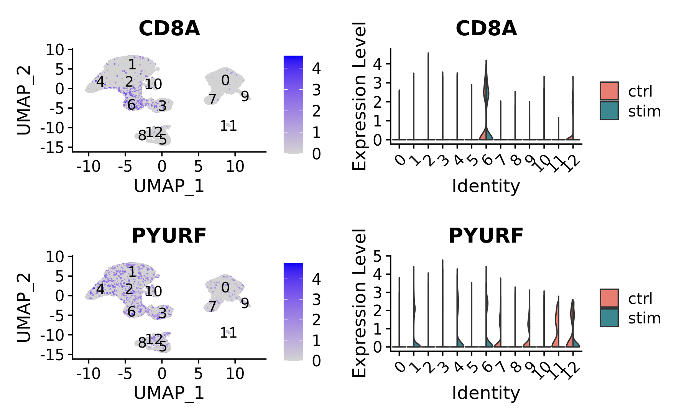
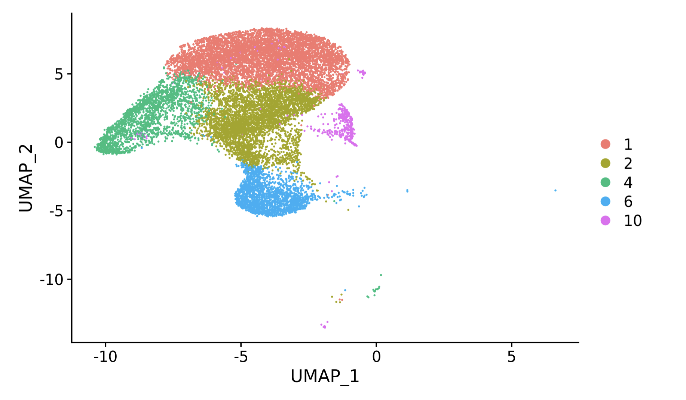
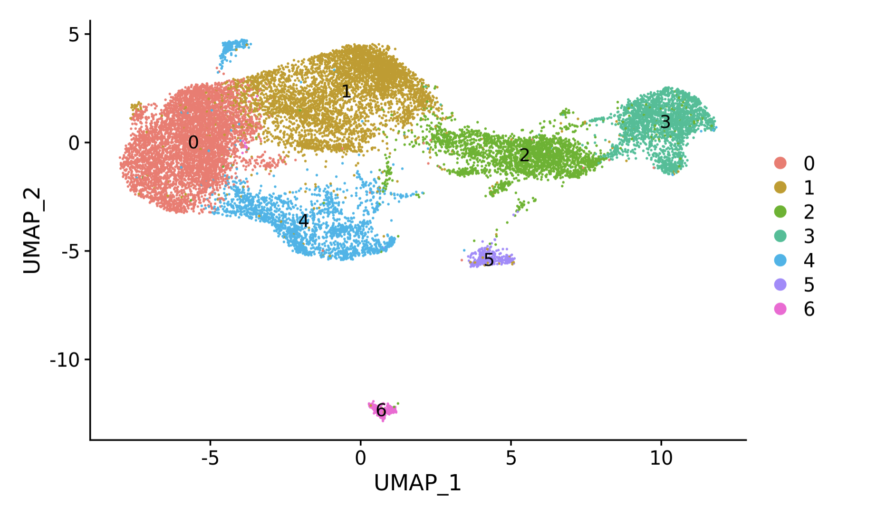
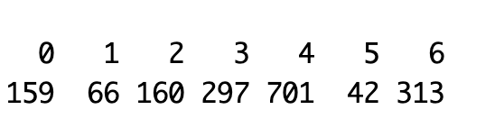
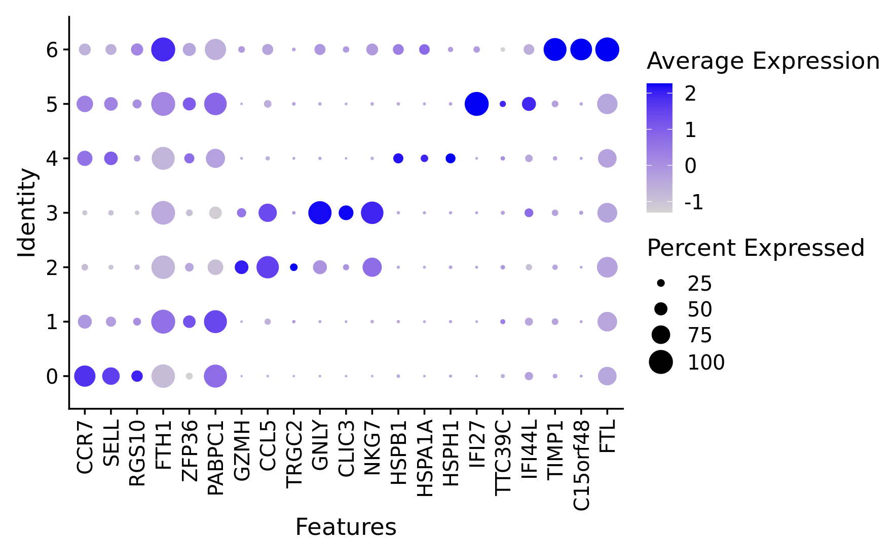

## Differential Expression 
Differential Expression in scRNAseq has multiple meanings. In this section we will focus on two types:
- Genes that are overexpressed in on cell-type compared to all other cell-types, known as "Marker Genes"
- Genes that are statistically different between groups of cells with different phenotypes or conditions, known as "Differentially Expressed Genes"

To start, we set our library path:
```R
LIB='/cluster/tufts/hpc/tools/R/4.0.0/'
.libPaths(c("",LIB))
```

We require new packages:
1) openxlsx
2) metap
3) clusterProfiler
4) org.Hs.eg.db

```R
suppressPackageStartupMessages({
  library(tidyverse)
  library(cowplot)
  library(Seurat)
  library(openxlsx)
  library(metap)
  library(clusterProfiler)
  library(org.Hs.eg.db)
})
```

Set the base dir:
```R
baseDir <- "~/intro_to_scrnaseq/"
```

Load data and select resolution
```R
integ_seurat = readRDS(file.path(baseDir, "data/clustered_seurat.rds"))
```

Set our identities to be the clusters found at the resolution 0.4 and set the RNA assay to be the default assay:
```R
Idents(object = integ_seurat) <- "integrated_snn_res.0.4"
DefaultAssay(integ_seurat) = "RNA"
```

Visualizations 

```R
feat1 <- FeaturePlot(integ_seurat, features=c("CD8A"), label=T)

vln1 <- VlnPlot(integ_seurat, 
        features=c("CD8A"),
        split.by="sample",
        split.plot = TRUE, 
        pt.size=0)

feat2 <- FeaturePlot(integ_seurat, features=c("PYURF"), label=T)

vln2 <- VlnPlot(integ_seurat, 
        features=c("PYURF"),
        split.by="sample",
        split.plot = TRUE, 
        pt.size=0)

plot_grid(feat1, vln1,  feat2, vln2, ncol = 2)

```


look more closely at t-cell subsets

```R
tcell = subset(integ_seurat, idents = c(1,2,4,6,10))
DefaultAssay(tcell) = "RNA"
DimPlot(tcell)
```

We need to reintegrate, here we load pre-processed integrated t-cell subset:

```R
tcell_int = readRDS(file.path(baseDir, "data/integrated_tcell.rds"))
```

```R
Idents(object = tcell_int) <- "integrated_snn_res.0.1"
DefaultAssay(tcell_int) = "RNA"
DimPlot(tcell_int, label=T)
```


Let's calculate conserved markers:
```R
all_conserved_markers = data.frame()
clusters = unique(tcell_int$integrated_snn_res.0.1)

for(cl in clusters){
  markers_conserved = FindConservedMarkers(tcell_int,
                                           ident.1 = cl,
                                           grouping.var = "orig.ident",
                                           only.pos = TRUE,
                                           logfc.threshold = 0.25)
  
  markers_conserved$cluster = cl
  markers_conserved$gene= rownames(markers_conserved)
  all_conserved_markers = rbind(all_conserved_markers, markers_conserved)
}
```

View the marker table:
```R 
view(all_conserved_markers)
```


Write markers:
```R
write.xlsx(all_conserved_markers, 
            file.path(baseDir,"results/findconservedmarkers_tcell_res_0.1.xlsx"))
```

Filter the markers
```R
markers_filter = all_conserved_markers  %>%
  dplyr::filter(max_pval<0.05)
```

Table of significant markers per cluster:
```R
table(markers_filter$cluster)
```

Let's find the top 3:
```R
markers_top3 = markers_filter %>%
  group_by(cluster) %>%
  slice_max(order_by=ctrl_avg_log2FC, n=3)

```

Plot:
```R
DotPlot(tcell_int, features=unique(markers_top3$gene)) + 
  theme(axis.text.x = element_text(angle = 90, vjust = 0.5, hjust=1))
```


Find the top 100:
```R
markers_top100 = markers_filter %>%
  group_by(cluster) %>%
  slice_max(order_by=ctrl_avg_log2FC, n=100)
```

GO Functional Enrichment:
```R
ck <- compareCluster(geneCluster = gene ~ cluster,
                     data = markers_top100,
                     OrgDb = org.Hs.eg.db,
                     keyType="SYMBOL",
                     fun = "enrichGO",
                     ont="BP",
                     universe=rownames(tcell_int@assays$RNA@counts))
```

Plot:
```R
dotplot(ck, 
        show=3,
        font.size=6)
```


Save:
```R
saveRDS(ck, 
        file.path(baseDir,"results/go_tcell_max_pval_0.05_res_0.1.rds"))
write.xlsx(ck, 
           file.path(baseDir,"results/go_tcell_max_pval_0.05_res_0.1.xlsx"))
```
