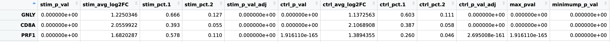

# Differential Expression [DRAFT]

In this section we will be looking at a complementary method to understanding the biological meaning of our clusters.

Differential Expression in scRNAseq has multiple meanings. In this section we will focus on two types:
- Genes that are overexpressed in on cell-type compared to all other cell-types, known as "Marker Genes"
- Genes that are statistically different between groups of cells with different phenotypes or conditions, known as "Differentially Expressed Genes"


To start, we set our library path:
```R
LIB='/cluster/tufts/hpc/tools/R/4.0.0/'
.libPaths(c("",LIB))
```

We require one new package:
- [openxlsx](https://cran.r-project.org/web/packages/openxlsx/index.html): Read/write Excel .xlsx files


```R
suppressPackageStartupMessages({
  library(tidyverse)
  library(cowplot)
  library(Seurat)
  library(openxlsx)
})
```

Set the base dir:
```R
baseDir <- "~/intro_to_scrnaseq/"
```

We begin by loading the integrated, clustered, and labeled cells from `results`, created in the last section. One may alternatively load the integrated, clustered object from `data`.

```R
integ_seurat = readRDS(file.path(baseDir, "results/labeled_seurat.rds"))
```

We again set identities to be the clusters found at the resolution 0.4 and set our default assay to be `RNA`:
```R 
Idents(object = integ_seurat) <- "integrated_snn_res.0.4"
DefaultAssay(integ_seurat) = "RNA"
```

Next, use a `DotPlot` to visualize expression of genes `CD8A` and `PYURF`. 
```R
DotPlot(integ_seurat, 
         features = c("CD8A","PYURF"))
```


Notice that `CD8A` is more highly expressed in cluster 6 compared with other clusters and is therefore likely to be a marker gene for cluster 6. `PYURF` expression, on the other hand, is not cluster-specific. 

Next, examine the expression of these two genes in our two conditions using `VlnPlot`.

```R

vln1 <- VlnPlot(integ_seurat, 
        features = "CD8A",
        split.by = "sample",
        split.plot = TRUE, 
        pt.size = 0)
    
vln2 <- VlnPlot(integ_seurat, 
        features = "PYURF",
        split.by = "sample",
        split.plot = TRUE, 
        pt.size = 0)

plot_grid(vln1, vln2, ncol = 2)

```


On the left we see that `CD8A` it is equally overexpressed in cluster 6 cells in the `ctr` and `stim` samples, while on the right we see that `PYURF` on the other hand seems to have condition-specific expression in several clusters, including cluster 6, and is likely differentially expressed by condition.


## Marker Genes

Next, use `FindConservedMarkers` to find the markers of cluster 6 that are overexpressed in both conditions:
```R
markers_6 = FindConservedMarkers(integ_seurat,
                                         ident.1 = 6,
                                         grouping.var = "sample",
                                         only.pos = TRUE,
                                         logfc.threshold = 0.25)
markers_6$cluster = 6
markers_6$gene = rownames(markers_6)

write.xlsx(markers_6, 
            file.path(baseDir,"results/conservedmarkers_6_res_0.4.xlsx"))                                         
```  
??? question "Can you write a for loop that runs `FindConservedMarkers` for all clusters and outputs a single table?" 
    - Hint: add a column to keep track of which cluster was `ident.1` in each iteration.
    
View the marker table:
```R 
view(markers_6)
```



Find the markers that are significant at a p.adjust 0.05 level and select the top 3 by `stim_avg_log2FC`:
```R
markers_6_top5 = markers_6 %>%
  dplyr::filter(max_pval<0.05) %>%
  slice_max(order_by=stim_avg_log2FC, n=5)
```

Plot:
```R
DotPlot(integ_seurat, features=markers_6_top5$gene) + 
  theme(axis.text.x = element_text(angle = 90, vjust = 0.5, hjust=1))
```


## Optional: Gene Ontology Functional Enrichment:

Find the top 100:
```R
markers_6_top100 = markers_6 %>%
  dplyr::filter(max_pval<0.05) %>%
  slice_max(order_by=stim_avg_log2FC, n=100)
```

Load additional packages
- [clusterProfiler](https://bioconductor.org/packages/release/bioc/html/clusterProfiler.html): Library for functional enrichment of omics data
- [org.Hs.eg.db](https://bioconductor.org/packages/release/data/annotation/html/org.Hs.eg.db.html): Bioconductor package providing genome wide annotation for Human

```R
library(clusterProfiler)
library(org.Hs.eg.db)
```

Run the `enrichGO` function: 
```R
ego <- enrichGO(gene = markers_6_top100$gene,
                     OrgDb = org.Hs.eg.db,
                     keyType="SYMBOL",
                     ont = "BP",
                     universe=rownames(integ_seurat@assays$RNA@counts))
```

Plot a dot plot:
```R
dotplot(ego,
        font.size=10)
```


## Differentially Expressed Genes


